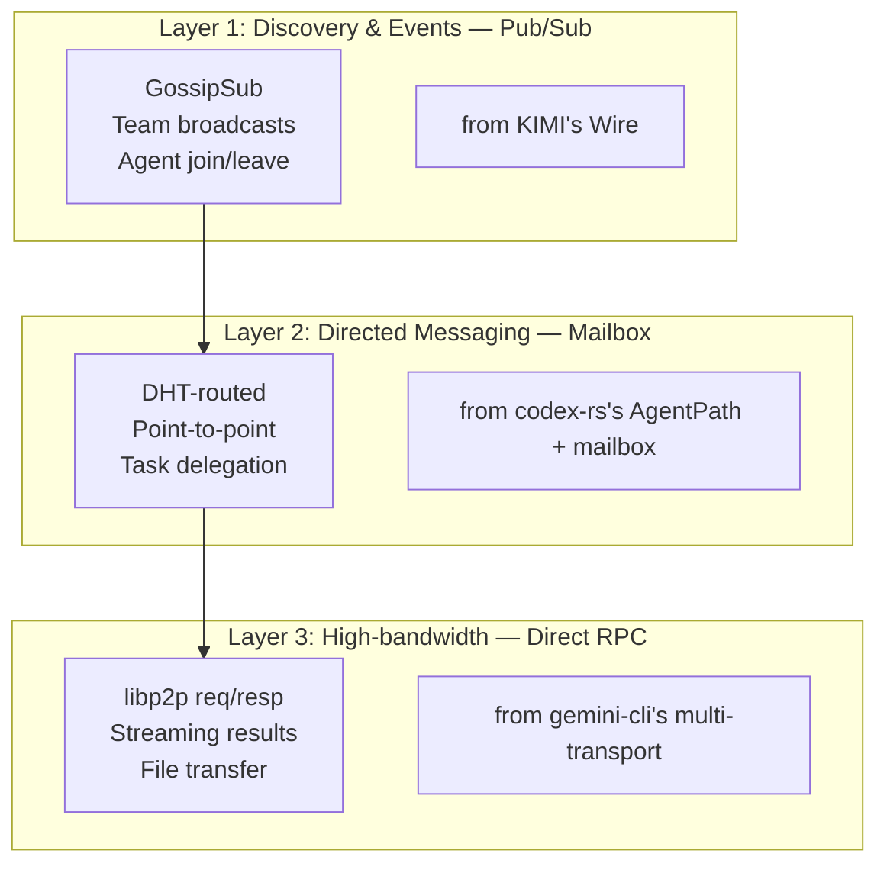
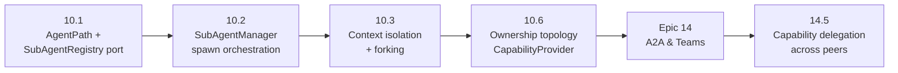

# Competitive Architecture Review — Epics 10 & 14

**Date:** 2026-05-01 (updated from 2026-04-30)
**Scope:** Epic 10 (Subagent Spawning & Ownership) and Epic 14 (A2A & Team Collaboration)
**Purpose:** Document findings from competitive analysis of six AI coding agent implementations, synthesize architectural recommendations for rustain, and capture open decisions for the long-term P2P decentralized workspace orchestrator.

**Sources analyzed:**

| Project | Language | Key Files Analyzed | Subagent Model | A2A Model | Google A2A Spec? |
|---------|----------|--------------------|----------------|-----------|-------------------|
| codex-rs | Rust | `core/src/agent/control.rs`, `core/src/agent/mailbox.rs`, `protocol/src/agent_path.rs` | Hierarchical actor tree, AgentPath addressing | Mailbox + InterAgentCommunication protocol | **No** — custom protocol |
| gemini-cli | TypeScript | `packages/core/src/agents/`, `packages/a2a-server/` | Subagents-as-tools (AgentTool pattern) | `@a2a-js/sdk` v0.3.11 — v0.3.x spec compliance | **Yes** — client + server |
| opencode | TypeScript (Effect-TS) | `packages/opencode/src/tool/task.ts`, `src/session/` | Session-tree with parentID, Task tool | Result-based (parent result capture only) | **No** — ACP for clients only |
| KIMI | Rust | `kimi-agent-rs/src/soul/agent.rs`, `tools/multiagent/` | LaborMarket registry, fixed/dynamic split | Wire pub/sub + SubagentEvent envelope | **No** — custom Wire protocol |
| openclaw | TypeScript | `src/agents/subagent-spawn.ts`, `subagent-announce.ts`, `session-visibility.ts` | Gateway sessions, spawnDepth tracking | Announce flow + SessionsSend tool | **No** — proprietary gateway protocol |
| rustycode | Rust | `domain/src/sub_agent.rs`, `application/src/services/sub_agent_manager.rs` | Hexagonal ports: SubAgentRegistry + MessageQueue | InterToolMessage + InMemoryMessageQueue | **No** — domain ports only |
| **a2a-rs** | Rust | `a2aproject/a2a-rs` (81 commits, 8 crates) | N/A (SDK only) | `a2a-lf` crates.io — v0.1.x, v1.0 spec target | **Yes** — official LF Rust SDK |

**Additional sources analyzed (2026-05-01 update):**
- [A2A Protocol Specification v1.0.0](https://a2a-protocol.org/latest/specification/) — released April 2026
- [A2A v1.0 "What's New"](https://a2a-protocol.org/latest/whats-new-v1/) — 7 breaking changes from v0.3.0
- [A2A Roadmap](https://a2a-protocol.org/latest/roadmap/) — SDKs, TCK, community governance
- [a2a-rs Rust SDK](https://github.com/a2aproject/a2a-rs) — official Rust A2A SDK (8 crates, `a2a-lf`)
- [a2a-lf on crates.io](https://crates.io/crates/a2a-lf) — core protocol types crate

**Participants:** Winston (Architect), Mary (Business Analyst), Amelia (Developer), Barry (Quick Flow Solo Dev)

**Rustain baseline:** Hexagonal architecture in place. Agent discovery/activation works (persona switching). `ApprovalSource` already has `ForegroundSubagent` and `BackgroundAgent` variants. `AgentCore` is a 2-line placeholder (`src/infrastructure/runtime/agent_core.rs:1-3`). No subagent runtime, no child conversations, no A2A protocol. `CapabilityProvider` trait described in CLAUDE.md but not implemented.

**Key finding (A2A protocol — updated 2026-05-01):** The Linux Foundation's A2A protocol has reached **v1.0** (April 2026) with significant breaking changes from v0.3.0 (SCREAMING_SNAKE_CASE enums, unified Part model, restructured AgentCard, google.rpc.Status errors). An official Rust SDK (`a2a-rs`, crate `a2a-lf`) exists at `a2aproject/a2a-rs` (81 commits, 8 crates) but is early-stage (v0.1.x, 20 stars, no known production deployments). **Rustain will NOT adopt A2A as its native protocol.** Instead, rustain will build `rustain-agent-protocol` (RAP) — a peer-native, crypto-first, transport-agnostic protocol — with an A2A compatibility adapter. See companion documents: `a2a-protocol-critique.md`, `rap-protocol-design.md`, `a2a-libraries-sdks-comparison.md`.

---

## 0. The Google A2A Protocol — Standard Analysis & Rustain's Strategy

Before analyzing the competitors' A2A approaches, we must understand what the A2A protocol is, its current state (v1.0), and rustain's strategic decision regarding it.

### 0.1 The A2A Protocol — Current State (v1.0, April 2026)

The Linux Foundation's Agent-to-Agent protocol reached **v1.0 in April 2026**. Key facts:

| Attribute | Detail |
|-----------|--------|
| **Governance** | **Linux Foundation** (not Google) |
| **License** | Apache-2.0 |
| **Spec version** | `1.0.0` (released April 2026) |
| **Previous versions** | `0.1.0`, `0.2.6`, `0.3.0` |
| **Reference SDK** | `@a2a-js/sdk` v0.3.11 (TypeScript, npm) — targeting v0.3.x only |
| **Rust SDK** | `a2a-rs` / `a2a-lf` v0.1.x (crates.io) — targeting v1.0 spec |
| **Normative spec** | `a2a.proto` — single source of truth for data model |
| **Architecture** | 3 layers: Data Model → Operations → Protocol Bindings |
| **Protocol bindings** | JSON-RPC 2.0, gRPC/Protobuf, HTTP+JSON/REST |
| **v0.3→v1.0 breakage** | 7 HIGH IMPACT breaking changes (see `a2a-protocol-critique.md`) |
| **Discovery** | `/.well-known/agent-card.json` with per-interface `protocolVersion` |
| **Security** | Bearer, API Key, OAuth2 (4 flows, PKCE), OIDC, mTLS |
| **Error model** | `google.rpc.Status` with `google.rpc.ErrorInfo` |
| **Roadmap** | TCK validation, SDKs in 5 languages, community governance |

**Major v1.0 changes (from v0.3.0):**
1. Enum values: `"completed"` → `"TASK_STATE_COMPLETED"` (SCREAMING_SNAKE_CASE)
2. Unified Part model: removed `kind` discriminator, merged TextPart+FilePart+DataPart
3. AgentCard restructured: `preferredTransport` + `additionalInterfaces` → `supportedInterfaces[]`
4. Error model: RFC 9457 → `google.rpc.Status` with protobuf ErrorInfo
5. Multi-tenancy: `tenant` field on all requests
6. Cursor-based pagination for ListTasks
7. AgentCard signing via JWS (RFC 8785 canonicalization + RFC 7515)

### 0.2 The Rust SDK: a2a-rs

The official Rust SDK (`a2aproject/a2a-rs`) provides 8 crates:

| Crate | Purpose | Maturity |
|-------|---------|----------|
| `a2a-lf` | Core types, errors, JSON-RPC, serde | Published (v0.1.x) |
| `a2a-client-lf` | Async client with transport negotiation | Published |
| `a2a-server-lf` | Axum-based server (REST + JSON-RPC) | Published |
| `a2a-pb` | Protobuf schema + prost-generated types | Published |
| `a2a-grpc` | tonic-based gRPC client + server | Published |
| `a2a-slimrpc` | SLIMRPC bindings | Published |
| `a2a-cli` | Standalone CLI binary | Published |

**Maturity:** Early stage — 81 commits, 72 releases (rapid churn), 20 stars, 4 forks. No known production use. Full analysis in `a2a-libraries-sdks-comparison.md`.

### 0.3 Rustain's Strategic Decision: Build RAP, Compat with A2A

**Rustain will NOT adopt the A2A protocol as its native protocol.** The A2A spec has fundamental architectural limitations for P2P use cases (see `a2a-protocol-critique.md`). Instead:

1. **Build `rustain-agent-protocol` (RAP)** — a peer-native, crypto-first, transport-agnostic, binary-efficient protocol. See `rap-protocol-design.md`.

2. **Provide an A2A compatibility adapter** (`A2aCompatTransport`) that translates RAP ↔ A2A messages, allowing rustain agents to interoperate with external A2A agents (gemini-cli, Go agents, etc.). See `a2a-libraries-sdks-comparison.md`.

3. **Expose A2A endpoints** (`/.well-known/agent-card.json`, JSON-RPC, gRPC) for ecosystem compatibility.

**Why not adopt A2A directly?**
- A2A is HTTP client-server; rustain needs P2P peers
- A2A has no cryptographic identity model; rustain needs Ed25519 signing
- A2A's v0.3→v1.0 had 7 breaking changes; rustain can't afford proto churn
- A2A has no DHT discovery, GossipSub, capability tokens, or multi-hop routing
- Rustain's hexagonal architecture demands its own domain types, not external SDK types

**What we DO adopt from A2A:**
- Proto-first normative specification approach (rap.proto)
- Unified Part model (clean, minimal, well-tested in v1.0)
- Extension mechanism with `required` flag + versioning
- AgentCard signing pattern (JWS with canonicalization)
- Transport abstraction philosophy (applied to P2P transports)

### 0.4 Task State Machine — RAP Compatibility with A2A

RAP defines its own state machine that is a **superset** of both rustycode's AgentStatus FSM and the A2A TaskState machine. The A2A compatibility adapter translates between them:

```
rustain AgentStatus    RAP TaskState              A2A TaskState (v1.0)
──────────────────     ──────────────              ──────────────────
Spawning               SUBMITTED                  TASK_STATE_SUBMITTED
Active                 WORKING                    TASK_STATE_WORKING
                       INPUT_REQUIRED             TASK_STATE_INPUT_REQUIRED
                       AUTH_REQUIRED              TASK_STATE_AUTH_REQUIRED
Completed              COMPLETED                  TASK_STATE_COMPLETED
Failed                 FAILED                     TASK_STATE_FAILED
Terminated             CANCELED                   TASK_STATE_CANCELED
—                      REJECTED                   TASK_STATE_REJECTED
—                      NEGOTIATING (RAP-only)     (no A2A equivalent)
—                      QUEUED (RAP-only)          (no A2A equivalent)
—                      DELEGATED (RAP-only)       (no A2A equivalent)
```

**Documents for deeper analysis:**
- `a2a-protocol-critique.md` — full critique of Google/LF A2A v0.x→v1.0
- `rap-protocol-design.md` — rustain-agent-protocol architecture & specification
- `a2a-libraries-sdks-comparison.md` — SDK comparison, dependency analysis, integration strategy

---

## 1. Epic 10 — Subagent Spawning & Ownership

### 1.1 Requirements Covered

| FR | Description | Key Architectural Concern |
|----|-------------|--------------------------|
| 10.1 | Define agent subagent profiles (YAML, Markdown) | `AgentDef` extension for subagent config — tools, model, sandbox policy |
| 10.2 | Spawn subagent from parent agent | `SubAgentRegistry` port trait with spawn lifecycle |
| 10.3 | Subagent context isolation (forked vs fresh) | `ContextPolicy` enum: `Isolated | Forked(limit) | Inherited` |
| 10.4 | Subagent panel/UI in TUI | Tree view widget, reusing `task_panel.rs` pattern |
| 10.5 | Subagent lifecycle management (status, terminate, cascade) | `AgentStatus` state machine, `SubAgentWorker` |
| 10.6 | Ownership topology (Owned/Peer/Self) | Capability-based ownership model from CLAUDE.md:110-115 |
| 10.7 | Config inheritance from parent to child | Permission rule propagation, model/model-override resolution |

### 1.2 Competitor Patterns

Three fundamental subagent spawning models emerged:

```
┌─────────────────────────────────────────────────────────────────────┐
│                    Subagent Spawning Architectures                   │
├──────────────────┬───────────────────────┬──────────────────────────┤
│ Model 1: Session │ Model 2: Tool-as-     │ Model 3: Registry        │
│ Tree + Task Tool │ Agent (gemini-cli,    │ (KIMI, rustycode)        │
│ (codex, opencode)│ openclaw)             │                          │
│                  │                       │                          │
│ Subagent = child │ Subagent = tool call  │ Subagent = registered    │
│ session in tree  │ with isolated context │ entity in a pool         │
│                  │                       │                          │
│ Natural hierarchy│ Couples agent to tool │ Cleanest separation of   │
│ Implicit parent  │ abstraction           │ discovery from spawning  │
│ through tree     │                       │                          │
├──────────────────┴───────────────────────┴──────────────────────────┤
│ Recommendation for rustain: Model 3 foundation                      │
│ (registry + hexagonal ports) with Model 1's parent-child tree       │
│ for conversation lineage                                            │
└─────────────────────────────────────────────────────────────────────┘
```

### 1.3 Key Findings Per Competitor

#### codex-rs — AgentPath + V2 Message Model (Take both)

codex-rs implements two generations of multi-agent tools:

**V1 (stable):** `spawn_agent`, `send_input`, `resume_agent`, `close_agent`, `wait_agent`
**V2 (development):** `spawn_agent`, `send_message`, `followup_task`, `close_agent`, `wait`, `list_agents`

The V2 migration replaces raw item-sending (`send_input`) with semantically-rich messaging (`send_message`/`followup_task`). This is the correct evolution: raw conversation items leak the parent's context model into the child.

**AgentPath** (`/root/researcher/analyst`) is the standout contribution. It is:
- A hierarchical, filesystem-like address that forms a DAG
- Resolvable relative to the caller (`../sibling` or absolute `/root/child`)
- Maps directly to P2P routing keys: `peer_id/root/researcher`

```rust
// codex-rs AgentPath (simplified)
pub struct AgentPath {
    segments: Vec<String>,  // ["root", "researcher", "analyst"]
}
impl AgentPath {
    fn parent(&self) -> Option<AgentPath>;
    fn join(&self, child: &str) -> AgentPath;
    fn resolve(&self, relative: &str) -> AgentPath;
}
```

**InterAgentCommunication** protocol message (codex-rs `protocol/src/protocol.rs:718-765`):
```rust
pub struct InterAgentCommunication {
    pub author: AgentPath,
    pub recipient: AgentPath,
    pub content: String,
    pub trigger_turn: bool,
}
```

**Verdict:** Adopt AgentPath as the universal agent identifier. Adopt the V2 message semantics (send_message/followup_task) over raw item-passing. Reject the actor model — actors are stateful and hard to distribute.

#### gemini-cli — Subagents-as-Tools + CompleteTaskTool (Reject the coupling, adopt the termination protocol)

gemini-cli's `AgentTool` pattern makes every subagent a tool callable by the parent. This has advantages (model natively understands when to delegate) but a fatal flaw for rustain's future: it couples agent spawning to the tool abstraction, making agents second-class citizens.

**The CompleteTaskTool** (`packages/core/src/tools/complete-task.ts`) is worth adopting independently: every subagent must explicitly signal completion by calling `complete_task`, which validates output against the agent's `OutputConfig` schema. This replaces implicit "the agent stopped talking" detection with an explicit protocol.

**Grace period recovery:** When subagents hit limits (timeout, max turns), gemini-cli gives one final turn to submit best-so-far results. This is a pragmatic UX pattern rustain should adopt.

**Verdict:** Reject the tool-as-agent pattern. Adopt CompleteTaskTool as an explicit termination protocol. Adopt grace period recovery for limit-exceeded subagents.

#### opencode — Permission Rule Inheritance (Take this)

opencode's `task.ts:60-97` shows how permission rules propagate from parent to child:

```
Parent permissions
    → Child's Agent.Info.permission rules evaluated
    → If child lacks `todowrite` → inject deny rule
    → If child lacks `task` → inject deny rule (prevents recursive spawning)
    → experimental.primary_tools → forced allow
    → Merged ruleset stored on child session
```

This is capability delegation done correctly: the parent grants a *subset* of its permissions to the child. For rustain's P2P future, this becomes chainable capability tokens.

**Verdict:** Adopt permission rule inheritance. Extend to capability delegation for P2P.

#### KIMI — Fixed vs Dynamic Subagents + Runtime Forking (Take both)

KIMI distinguishes two agent types with different lifecycle policies:

| Type | Creation | Isolation | LaborMarket |
|------|----------|-----------|-------------|
| **Fixed** | Loaded from YAML at startup | Fresh LaborMarket (can't see siblings) | Registered in parent's `fixed_subagents` |
| **Dynamic** | Created via `CreateSubagent` tool at runtime | Shared LaborMarket (can see other dynamics) | Registered in parent's `dynamic_subagents` |

The `Runtime::copy_for_fixed_subagent()` vs `copy_for_dynamic_subagent()` distinction controls what state is shared vs isolated:

```rust
// Fixed subagent: completely fresh context
fn copy_for_fixed_subagent(&self) -> Runtime {
    Runtime {
        labor_market: Arc::new(Mutex::new(LaborMarket::new())),  // NEW empty
        denwa_renji: Arc::new(Mutex::new(DenwaRenji::new())),    // Fresh D-Mail
        approval: Arc::new(self.approval.share()),                // Shared state, separate queue
        // ... same config, llm, session, environment, skills
    }
}

// Dynamic subagent: shares parent's market
fn copy_for_dynamic_subagent(&self) -> Runtime {
    Runtime {
        labor_market: Arc::clone(&self.labor_market),  // SHARED
        // ... rest same
    }
}
```

**Verdict:** Adopt fixed/dynamic distinction. Fixed = workspace infrastructure agents (always-on). Dynamic = task-specific ephemeral agents. Map the runtime forking to rustain's `SandboxPolicy` (`src/domain/models/sandbox.rs`).

#### openclaw — Spawn Lifecycle + Subagent Registry (Take the phases, reject centralized gateway)

openclaw's `spawnSubagentDirect()` (`subagent-spawn.ts:626-1255`) defines the most comprehensive spawn lifecycle:

1. **Validation** — agentId format, spawn depth, sandbox compatibility, child count limits
2. **Session Setup** — child session key, capabilities resolution, context mode (`isolated` or `fork`), thread binding
3. **Agent Start** — embedded agent run with `buildSubagentSystemPrompt`
4. **Post-Spawn** — registry registration, lifecycle hooks, session event emission

The subagent registry (`subagent-registry.ts`) persists run records with `spawnedBy` parent links, timing metadata, and `frozenResultText` for completed subagents.

**Verdict:** Adopt the 4-phase spawn lifecycle as application-layer orchestration. Reject centralized gateway — the registry must be a swappable port.

#### rustycode — Hexagonal Ports + State Machine (Adopt as structural reference)

rustycode is the only competitor to treat subagent management as a **domain concern** with formal port traits:

```rust
// domain/src/sub_agent.rs
#[async_trait]
pub trait SubAgentRegistry: Send + Sync {
    async fn register(&self, agent: SubAgent) -> Result<()>;
    async fn unregister(&self, agent_id: SubAgentId) -> Result<()>;
    async fn get(&self, agent_id: SubAgentId) -> Result<Option<SubAgent>>;
    async fn update_status(&self, agent_id: SubAgentId, status: AgentStatus) -> Result<()>;
    async fn get_all_for_session(&self, session_id: SessionId) -> Result<Vec<SubAgent>>;
    async fn register_with_limit(&self, agent: SubAgent, max_agents: usize) -> Result<()>;
}

#[async_trait]
pub trait SubAgentMessageQueue: Send + Sync {
    async fn send(&self, message: SubAgentMessage) -> Result<()>;
    async fn receive(&self, agent_id: SubAgentId) -> Result<Vec<SubAgentMessage>>;
    async fn peek(&self, agent_id: SubAgentId) -> Result<Option<SubAgentMessage>>;
    async fn clear(&self, agent_id: SubAgentId) -> Result<()>;
}
```

**AgentStatus state machine** (5 states, exactly what rustain needs):
```
Spawning → Active → Completed / Failed / Terminated
```

The `register_with_limit()` method uses `AtomicUsize` for race-condition-free spawning with limits. Cascade termination (`terminate_sub_agent.rs:55-88`) recursively terminates child agents using depth-first traversal of the parent-child tree.

**Critique:** The `SubAgentWorker` with polling + deduplication (`sub_agent_worker.rs:105-146`) is a leaky abstraction. The domain should not know about polling loops. Replace with event-driven push via the message bus — KIMI's pub/sub pattern is the reference.

**Critique:** The `InMemoryMessageQueue` with FIFO `VecDeque` per agent is correct in-process, but the port trait is point-to-point only. A P2P system needs broadcast semantics. Extend with a `broadcast(scope: VisibilityScope, message)` method.

**Verdict:** Adopt rustycode's port traits and state machine as the structural template. Replace polling with push. Extend message queue with broadcast semantics.

### 1.4 Recommended Architecture for Epic 10

```mermaid
graph TD
    subgraph "Domain Layer (pure, no I/O)"
        AP[AgentPath<br/>hierarchical address<br/>from codex-rs]
        AS[AgentStatus<br/>Spawning → Active →<br/>Completed / Failed / Terminated<br/>from rustycode]
        SD[SubAgentDescriptor<br/>name, tools, model, sandbox<br/>fixed vs dynamic: from KIMI]
        CP[ContextPolicy<br/>Isolated | Forked(limit) | Inherited<br/>from KIMI + openclaw]
        SS[SpawnSpec<br/>parent, descriptor, context,<br/>capabilities, ownership]
    end

    subgraph "Ports (trait definitions)"
        SAR[SubAgentRegistry<br/>spawn, lookup, terminate, watch<br/>from rustycode]
        SMQ[SubAgentMessageQueue<br/>send, receive, peek,<br/>broadcast, clear<br/>extended from rustycode]
        AD[AgentDiscovery<br/>discover, register<br/><i>new — Mary's 3-port split</i><br/>from KIMI + openclaw]
    end

    subgraph "Application Layer"
        SM[SubAgentManager<br/>spawn orchestration<br/>4-phase lifecycle<br/>from openclaw]
        SW[SubAgentWorker<br/>event-driven executor<br/>NOT polling-based]
        CT[CompleteTaskTool<br/>explicit termination<br/>from gemini-cli]
    end

    subgraph "Adapters (I/O)"
        IMR[InMemoryRegistry<br/>RwLock + AtomicUsize<br/>from rustycode]
        IMB[InMemoryMessageBus<br/>broadcast per scope<br/>extended for P2P readiness]
        FSB[FilesystemContextStore<br/>isolated JSONL per subagent<br/>from KIMI]
    end

    SM -->|uses| SAR
    SM -->|uses| SMQ
    SW -->|uses| SAR
    SW -->|uses| SMQ
    SAR -->|implemented by| IMR
    SMQ -->|implemented by| IMB
    SM -->|uses| FSB
```

**New domain types:**

| Type | Location | Purpose |
|------|----------|---------|
| `AgentPath` | `src/domain/models/agent_path.rs` (new) | Hierarchical agent address (from codex-rs) |
| `SubAgentDescriptor` | `src/domain/models/agent.rs` (extend) | Agent config for spawning: tools, model, sandbox, type (fixed/dynamic) |
| `ContextPolicy` | `src/domain/models/conversation.rs` (extend) | Forking strategy: Isolated, Forked(u64 limit), Inherited |
| `SpawnSpec` | `src/domain/models/agent.rs` (extend) | Spawn parameters: parent, descriptor, context, capabilities |
| `AgentOwnership` | `src/domain/models/agent.rs` (new) | Enum: Owned, Peer, Self (from CLAUDE.md:110-115) |

**New ports:**

| Port | Location | Methods |
|------|----------|---------|
| `SubAgentRegistry` | `src/domain/ports/sub_agent_registry.rs` (new) | `spawn(SpawnSpec) → AgentHandle`, `lookup(AgentPath) → AgentHandle`, `terminate(AgentPath, cascade)`, `watch(AgentPath) → Stream<AgentStatus>` |
| `SubAgentMessageBus` | `src/domain/ports/message_bus.rs` (new) | `send(from, to, msg)`, `broadcast(from, scope, msg)`, `subscribe(scope) → Stream<Envelope>` |
| `AgentDiscovery` | `src/domain/ports/agent_discovery.rs` (new) | `discover(scope, capabilities) → Vec<AgentCard>`, `register(AgentCard)` |

**Note:** Mary's recommended 3-port split (Spawning / Communication / Discovery) is adopted. Each port has a single responsibility and can be swapped to P2P adapters independently.

### 1.5 File Map

```
src/domain/
  models/
    agent_path.rs          ← NEW: AgentPath, address resolution
    agent.rs               ← EXTEND: SubAgentDescriptor, SpawnSpec, AgentOwnership
    conversation.rs        ← EXTEND: parent_id field, ContextPolicy enum
  ports/
    sub_agent_registry.rs  ← NEW: SubAgentRegistry trait
    message_bus.rs         ← NEW: SubAgentMessageBus trait
    agent_discovery.rs     ← NEW: AgentDiscovery trait
  services/
    sub_agent_manager.rs   ← NEW: spawn orchestration (4-phase lifecycle)
    complete_task.rs       ← NEW: CompleteTaskTool domain logic

src/application/
  subagent/
    spawn/
      service.rs           ← NEW: SpawnService (orchestration)
      context_resolve.rs   ← NEW: ContextPolicy resolution
    lifecycle/
      worker.rs            ← NEW: event-driven SubAgentWorker
      termination.rs       ← NEW: cascade termination
    messaging/
      router.rs            ← NEW: AgentMessageRouter (Mediator)

src/adapters/
  subagent/
    registry/
      in_memory.rs         ← NEW: InMemorySubAgentRegistry (RwLock + AtomicUsize)
    messaging/
      in_memory.rs         ← NEW: InMemoryMessageBus (broadcast per scope)
      envelope.rs          ← NEW: AgentMessage envelope (from AgentPath, to AgentPath, content, signature)
    context/
      filesystem.rs        ← NEW: FilesystemContextStore (JSONL per subagent)

src/infrastructure/
  runtime/
    agent_core.rs          ← REPLACE: 2-line placeholder → full AgentCore implementation
```

---

## 2. Epic 14 — A2A & Team Collaboration

### 2.1 Requirements Covered

| FR | Description | Key Architectural Concern |
|----|-------------|--------------------------|
| 14.1 | A2A messaging between agents | `AgentMessageBus` port with transport-agnostic routing |
| 14.2 | Cross-workspace agent discovery | `AgentDiscovery` port with `AgentCard` registration |
| 14.3 | Team definition and membership | `Team` entity with hierarchical ownership |
| 14.4 | A2A protocol (JSON-RPC/gRPC/libp2p) | `A2aTransport` port with multi-transport adapters |
| 14.5 | Capability delegation | `CapabilityProvider` with chainable tokens |
| 14.6 | A2A configuration (`.rustain/a2a.json`) | `A2aConfig` loading from TOML |

### 2.2 Competitor Patterns

Three communication models exist, and rustain needs all three at different layers:



| Layer | Pattern | Used for | Competitor reference |
|-------|---------|----------|---------------------|
| **Discovery & Events** | Pub/Sub (GossipSub) | Agent join/leave, team formation, status broadcasts | KIMI's Wire |
| **Directed Messaging** | Mailbox (DHT-routed) | Task delegation, result delivery, capability negotiation | codex-rs's AgentPath + InterAgentCommunication |
| **High-bandwidth** | Direct RPC | Streaming generation results, file sync | gemini-cli's multi-transport SDK |

### 2.3 Key Findings Per Competitor

#### codex-rs — InterAgentCommunication Protocol (Take the protocol message, reject the transport)

codex-rs's `InterAgentCommunication` protocol message (`protocol.rs:718-765`) is the right envelope format:

```rust
pub struct InterAgentCommunication {
    pub author: AgentPath,
    pub recipient: AgentPath,
    pub other_recipients: Vec<AgentPath>,
    pub content: String,
    pub trigger_turn: bool,
}
```

It captures: who sent it, who it's for, what it contains, and whether the recipient should be woken up. This is a protocol-level concern, not a transport concern.

**The gap:** No signed envelope. For P2P, the message must be cryptographically signed. Extend to:

```rust
pub struct AgentEnvelope {
    pub header: EnvelopeHeader { author, recipient, content_hash, nonce, ttl },
    pub body: AgentMessage,
    pub signature: Ed25519Signature,  // or libp2p Noise-signed
}
```

**Verdict:** Adopt the protocol message structure. Add cryptographic envelope for P2P.

#### gemini-cli — Multi-Transport A2A SDK + The Only Spec-Compliant A2A (Adopt the protocol)

gemini-cli's `@a2a-js/sdk` v0.3.11 is the **reference implementation of the Linux Foundation's A2A protocol**. It is the only competitor in this survey that implements the actual open standard rather than a custom protocol. Three transports:

| Transport | Use case | Rustain equivalent |
|-----------|----------|-------------------|
| **REST** | Simple request/response | `JsonRpcTransport` adapter |
| **JSON-RPC** | Bidirectional streaming | `JsonRpcTransport` adapter (reuse) |
| **gRPC** | High-performance, typed contracts | `GrpcTransport` adapter |

**AgentCard** — the A2A spec's capability advertisement (matches our `AgentDiscovery` port exactly):

```typescript
// gemini-cli concept, adapted for rustain
pub struct AgentCard {
    pub agent_id: AgentPath,
    pub display_name: String,
    pub description: String,
    pub capabilities: Vec<Capability>,
    pub endpoints: Vec<Endpoint>,  // transport addresses
    pub signature: Ed25519Signature,
}
```

**Verdict:** Adopt the multi-transport abstraction. Define AgentCard as a domain value object. Implement `JsonRpcTransport` first, `GrpcTransport` second, `Libp2pTransport` third.

#### opencode — ACP for External Clients (Adopt as client-facing protocol)

opencode's ACP (Agent Client Protocol) bridges external clients (Zed editor) to internal sessions via JSON-RPC over stdio. This is the *client* protocol, orthogonal to A2A. rustain needs both:

```
ACP  → client-to-agent (external tools, editors)
A2A  → agent-to-agent (internal team collaboration)
```

**Verdict:** ACP is a separate concern. Note for future but don't conflate with Epic 14.

#### KIMI — Wire Pub/Sub + SubagentEvent Envelope (Take the event architecture)

KIMI's Wire provides a broadcast message bus with three sides (soul, UI, recorder) and a `SubagentEvent` envelope that wraps child events for the parent:

```rust
pub struct SubagentEvent {
    pub task_tool_call_id: String,  // links to parent's invocation
    pub event: Box<WireMessage>,    // the inner event
}
```

This is the event-driven backbone rustain needs. The key insight: **approval requests and tool calls from subagents are forwarded directly to the parent wire.** Content events are wrapped in the SubagentEvent envelope. This is the correct separation between control-plane and data-plane events.

**Verdict:** Adopt the Wire pub/sub model. The `SubAgentMessageBus` port's `subscribe(scope)` and `broadcast(scope, msg)` methods are the KIMI pattern, formalized.

#### openclaw — Session Visibility Model (Take this — it's the authorization layer)

openclaw's session visibility model (`session-visibility.ts:20-26`) defines four scopes:

```rust
pub enum VisibilityScope {
    Self_,   // Only the agent itself
    Tree,    // Agent + all descendants
    Agent,   // All sessions within the same agent workspace
    All,     // Cross-agent (requires a2a.enabled=true)
}
```

This maps directly to P2P trust domains:
- `Self` → local process
- `Tree` → DHT subtree (peers responsible for a key range)
- `Agent` → specific peer via DHT lookup
- `All` → GossipSub broadcast

openclaw's `agentToAgent` policy config (`tools.agentToAgent.enabled` + `allow` list with glob patterns) is the policy-driven communication that rustain needs.

**Verdict:** Adopt VisualScope as a domain enum. Adopt `agentToAgent` policy pattern.

#### openclaw — Announce Flow (Take with caution — powerful but complex)

```
child completion → descendant aggregation → steered/queued/direct delivery
```

The announce flow is a **convergence protocol**: results propagate up the spawn tree and aggregate. In P2P terms, this is a tree-based reduce operation. Elements to adopt:

1. **Descendant aggregation** — when a subagent completes, its own subagents' results are gathered
2. **Wake-on-descendants** — a parent blocked on `wait` is woken when all children settle
3. **Delivery dispatch** — steer (inject into running turn), queue (for next turn), direct (immediate)

**Critique (Barry):** The full announce flow with four delivery paths is overengineered for a CLI tool. A simpler Mediator pattern (`AgentMessageRouter`) with a single routing table achieves the same result.

**Resolution:** The routing should start simple (Mediator) and evolve to the announce flow only if needed. The `SubAgentMessageBus::broadcast(scope, msg)` port already supports both — the adapter decides delivery semantics.

### 2.4 Recommended Architecture for Epic 14

```mermaid
graph TD
    subgraph "Domain Layer"
        AP2[AgentPath<br/>peer_id/team/role]
        VS[VisibilityScope<br/>Self | Tree | Agent | All<br/>from openclaw]
        AC[AgentCard<br/>signed capability advertisement<br/>from gemini-cli]
        TM[Team<br/>members, roles, hierarchy<br/>from rustycode RBAC]
        CT2[CapabilityToken<br/>chainable delegation<br/>from opencode permission inheritance]
        AE[AgentEnvelope<br/>header + body + signature]
    end

    subgraph "Ports (trait definitions)"
        AMB[AgentMessageBus<br/>send, broadcast, subscribe<br/>from codex-rs + KIMI]
        AD2[AgentDiscovery<br/>discover, register, revoke<br/>from KIMI LaborMarket]
        AT[A2aTransport<br/>connect, send, stream, close<br/>from gemini-cli]
        CP2[CapabilityProvider<br/>delegate, validate, revoke<br/>from CLAUDE.md:62-79]
    end

    subgraph "Application Layer"
        MR[MessageRouter<br/>Mediator pattern<br/>all messages flow through here<br/>from Barry's recommendation]
        TS[TeamService<br/>CRUD, membership, hierarchy]
        CG[CapabilityGrant<br/>token issuance + validation]
    end

    subgraph "Adapters (I/O)"
        JR[JsonRpcTransport<br/>from gemini-cli]
        GT[GrpcTransport<br/>from gemini-cli]
        LP[Libp2pTransport<br/>GossipSub + Kademlia +<br/>request/response<br/>P2P phase]
        DD[DhtDiscovery<br/>Kademlia DHT<br/>from codex-rs AgentPath → DHT key]
        NS[NoiseSigner<br/>envelope signing<br/>+ verification]
    end

    AMB -->|implemented by| LP
    AD2 -->|implemented by| DD
    AT -->|implemented by| JR
    AT -->|implemented by| GT
    AT -->|implemented by| LP
    CP2 -->|uses| NS
```

**New domain types:**

| Type | Location | Purpose |
|------|----------|---------|
| `VisibilityScope` | `src/domain/models/a2a.rs` (new) | Self, Tree, Agent, All (from openclaw) |
| `AgentCard` | same file | Signed capability advertisement (from gemini-cli) |
| `AgentEnvelope` | same file | Signed message envelope (header + body + signature) |
| `Team` | `src/domain/models/team.rs` (new) | Members, roles, parent team hierarchy |
| `CapabilityToken` | `src/domain/models/capability.rs` (new) | Chainable capability grant token |

**New ports:**

| Port | Location | Methods |
|------|----------|---------|
| `AgentMessageBus` | `src/domain/ports/message_bus.rs` | `send(from, to, envelope)`, `broadcast(from, scope, envelope)`, `subscribe(scope) → Stream<Envelope>` |
| `AgentDiscovery` | `src/domain/ports/agent_discovery.rs` | `discover(scope, capabilities) → Vec<AgentCard>`, `register(card)`, `revoke(path)` |
| `A2aTransport` | `src/domain/ports/a2a_transport.rs` (new) | `connect(endpoint)`, `send(envelope)`, `stream() → Stream<Envelope>`, `close()` |
| `CapabilityProvider` | `src/domain/ports/capability_provider.rs` (new) | `delegate(to, subset) → Token`, `validate(token) → CapabilitySet`, `revoke(token)` |

**Note:** The `CapabilityProvider` trait described in CLAUDE.md:62-79 (DISCOVER → ACTIVATE → EXECUTE → RENDER → GOVERN) is a separate lifecycle from A2A messaging. The A2A ports handle communication; `CapabilityProvider` handles what an agent *can do*. They are orthogonal.

### 2.5 File Map

```
src/domain/
  models/
    a2a.rs                  ← NEW: VisibilityScope, AgentCard, AgentEnvelope
    team.rs                 ← NEW: Team, TeamMember, TeamRole
    capability.rs           ← NEW: CapabilityToken, CapabilitySet
  ports/
    message_bus.rs          ← NEW: AgentMessageBus trait (shared with Epic 10)
    agent_discovery.rs      ← NEW: AgentDiscovery trait (shared with Epic 10)
    a2a_transport.rs        ← NEW: A2aTransport trait
    capability_provider.rs  ← NEW: CapabilityProvider trait (from CLAUDE.md)
  services/
    message_router.rs       ← NEW: Mediator routing logic
    capability_grant.rs     ← NEW: token issuance, validation, revocation

src/application/
  a2a/
    config/
      loader.rs             ← NEW: .rustain/a2a.json → A2aConfig
    message/
      router.rs             ← NEW: AgentMessageRouter implementation
    team/
      service.rs            ← NEW: TeamService (CRUD + hierarchy + cycle detection)
    capability/
      delegator.rs          ← NEW: CapabilityDelegator

src/adapters/
  a2a/
    transport/
      json_rpc.rs           ← NEW: JsonRpcTransport
      grpc.rs               ← NEW: GrpcTransport (deferred)
      libp2p.rs             ← NEW: Libp2pTransport (P2P phase)
    discovery/
      local_directory.rs    ← NEW: wraps SubAgentRegistry (current phase)
      dht_directory.rs      ← NEW: Kademlia DHT (P2P phase)
    signing/
      noise_signer.rs       ← NEW: Noise-based envelope signing
      noop_signer.rs        ← NEW: noop stub for pre-P2P

src/infrastructure/
  runtime/
    event_loop.rs           ← EXTEND: wire A2A event handling into tokio::select!
    agent_core.rs           ← EXTEND: route A2A messages through AgentCore
```

---

## 3. Cross-Epic Intersections

### 3.1 Shared Ports Between Epics 10 and 14

Two ports are shared:

```
Epic 10                          Epic 14
  │                                │
  │  SubAgentRegistry              │
  │       ↓                        │
  ├──── AgentMessageBus ◄──────────┤  (shared: send, broadcast, subscribe)
  ├──── AgentDiscovery ◄───────────┤  (shared: discover, register)
  │                                │
  │  AgentOwnership                │
  │       ↓                        │
  └──── CapabilityProvider ────────┘  (spawn = delegate capability)
```

This is intentional. The `AgentMessageBus` and `AgentDiscovery` ports are shared because they are the same concern whether the agent is local or remote. The `CapabilityProvider` bridges both epics: spawning a subagent *is* delegating a capability.

### 3.2 AgentPath as Universal Identifier

Every architecture decision traces back to `AgentPath`. It is:
- The identity for spawning (`SubAgentRegistry::spawn(parent: AgentPath, ...)`)
- The address for messaging (`AgentMessageBus::send(to: AgentPath, ...)`)
- The key for discovery (`AgentDiscovery::register(AgentPath, ...)`)
- The routing key for P2P (`peer_id/team/role` → Kademlia DHT key)

Define `AgentPath` first. Everything else composes around it.

### 3.3 Epic Ordering

Epic 10 ships before Epic 14. The dependency chain:



Rationale: A2A communication requires agent identities (AgentPath) and a spawn model (registry). Build those in Epic 10 first.

---

## 4. What to Adopt, What to Reject

### 4.1 Adopt

| Source | Pattern | Reason |
|--------|---------|--------|
| **codex-rs** | `AgentPath` hierarchical addressing | Intuitive, maps to DHT keys, resolves elegantly |
| **codex-rs** | `InterAgentCommunication` protocol message | Well-structured envelope with author/recipient/trigger_turn |
| **codex-rs** | V2 message semantics (send_message/followup_task) | Semantic messages over raw item-passing |
| **gemini-cli** | Multi-transport A2A (REST/JSON-RPC/gRPC) | Transport-agnostic architecture, P2P-ready |
| **gemini-cli** | A2A v0.3.x transport abstraction pattern (REST/JSON-RPC/gRPC) | Rustain adopts the transport-agnostic pattern (not the spec itself) |
| **gemini-cli** | `AgentCard` standard capability advertisement | Needed for P2P discovery |
| **gemini-cli** | `CompleteTaskTool` explicit termination protocol | Avoids implicit "agent stopped" detection |
| **gemini-cli** | Grace period recovery for limit-exceeded subagents | Better UX than silent truncation |
| **opencode** | Permission rule inheritance (parent → child) | Becomes capability delegation for P2P |
| **KIMI** | Fixed vs dynamic subagent distinction | Workspace infra vs task-specific ephemeral |
| **KIMI** | Wire pub/sub event bus + `SubagentEvent` envelope | Event-driven backbone for P2P |
| **KIMI** | `LaborMarket` registry pattern | Service locator for agent discovery |
| **openclaw** | `VisibilityScope` (Self/Tree/Agent/All) | Maps directly to P2P trust scopes |
| **openclaw** | 4-phase spawn lifecycle (validate → setup → start → post-spawn) | Clean orchestration |
| **openclaw** | `agentToAgent` policy config (enabled + allow list) | Policy-driven communication |
| **openclaw** | Descendant-aware result aggregation | Tree-based result convergence |
| **rustycode** | `SubAgentRegistry` + `SubAgentMessageQueue` port traits | Hexagonal architecture reference |
| **rustycode** | `AgentStatus` 5-state machine (Spawning → Active → Completed/Failed/Terminated) | Clean lifecycle FSM |
| **rustycode** | `register_with_limit()` with atomic operations | Race-condition-free spawning |
| **rustycode** | Cascade termination (DFS of parent-child tree) | Proper cleanup of agent sub-trees |
| **rustycode** | `InterToolMessage` separation from agent comm | Correct separation of concerns |
| **rustycode** | RBAC + Team-based ownership | Foundation for P2P capability-based security |
| **a2a-rs** | Proto-first spec (`rap.proto`), protobuf code-gen (`prost`) | Rust-native A2A implementation reference; rustain copies the approach for RAP |
| **a2a-rs** | Crate separation (core/client/server/pb/grpc) | Clean workspace structure to emulate for RAP crates |
| **a2a-protocol.org** | Unified Part model (v1.0) | Clean oneof: text/raw/url/data — adopted verbatim in RAP |
| **a2a-protocol.org** | Extension mechanism with `required` + versioning | Protocol extensibility pattern |
| **a2a-protocol.org** | AgentCard signing (JWS + JCS canonicalization) | Cryptographic trust for agent identity |

### 4.2 Reject

| Source | Pattern | Reason |
|--------|---------|--------|
| **codex-rs** | Actor model with stateful agents | Hard to distribute; prefer stateless handlers |
| **codex-rs** | No network protocol at all | Won't survive the transition to P2P |
| **gemini-cli** | Subagents-as-tools (`AgentTool` pattern) | Couples agent spawning to tool abstraction |
| **gemini-cli** | Recursion prohibition (agents can't call agents) | Blocks transitive delegation; use capability-based gating instead |
| **gemini-cli** | `development-tool` A2A extension | Google/Gemini-specific; rustain can define its own extensions if needed |
| **opencode** | Parent-only result capture | Command-and-control; no bidirectional A2A |
| **opencode** | No subagent event bus | Couples lifecycle to tool result channel |
| **KIMI** | `spawn_blocking` synchronous execution | Blocks event loop; everything must be async for P2P |
| **KIMI** | Filesystem-based context isolation (JSONL files) | Doesn't survive network boundaries |
| **openclaw** | Centralized Gateway architecture | Single point of failure for P2P |
| **openclaw** | `spawnDepth` as reactive limit | Arbitrary limit instead of capability model |
| **openclaw** | Full announce flow with 4 delivery paths | Overengineered for a CLI tool; start with Mediator |
| **rustycode** | Polling-based `SubAgentWorker` | Leaky abstraction; replace with event-driven push |
| **rustycode** | `InMemory*` adapters without P2P path | Correct for now but the port must not assume local |
| **a2a-protocol.org** | A2A as native protocol (adopting the spec wholesale) | HTTP client-server model fails for P2P; 7 breaking changes v0.3→v1.0; no crypto identity. Use RAP + A2A compat adapter instead. |

---

## 5. Closed Decisions (Final Resolutions — 2026-05-01)

Roundtable consensus reached on all four open decisions. These are now binding architectural constraints.

### 5.1 Port Granularity: 3-Port Split (RESOLVED)

**Resolution:** Three separate domain port traits in `src/domain/ports/`:

```rust
pub trait SubAgentRegistry { ... }    // spawning lifecycle
pub trait AgentMessageBus { ... }     // messaging (send, broadcast, subscribe)
pub trait AgentDiscovery { ... }      // lookup (discover, register)
```

**Rationale:** Rustain already has 14 port traits — splitting is consistent with the existing architecture. The 4-phase P2P migration requires independent adapter swaps: Discovery may go P2P (Kademlia DHT) while Communication stays in-process during migration. Tight coupling in a single `AgentCore` trait forces touch points across all concerns when only one changes. The wiring cost at the composition root is one-time; tight coupling in the port interface is permanent.

**Vote:** Winston (3-port), Mary (3-port), Amelia (single port), Barry (single port). **Resolved 2-2 by orchestrator tie-break for 3-port split** — consistency with existing 14-port architecture and P2P migration independence are decisive.

### 5.2 Announce Flow vs Mediator Pattern (RESOLVED)

**Resolution:** Mediator pattern via `AgentMessageRouter` — a single `HashMap<AgentPath, Vec<Sender<AgentEnvelope>>>` with ~80 LOC of routing logic. Add an ADR noting announce flow (tree-based convergence with steered/queued/direct delivery) as the planned upgrade path for v2.5+ if convergence latency becomes a measured bottleneck.

**Rationale:** AC-SPAWN-07 only requires "parent receives completion event" — Mediator satisfies it. Announce flow's 4 delivery paths demand 4x tests and 4x edge cases without data showing the complexity is warranted. The `AgentMessageBus::broadcast(scope, msg)` method already supports hierarchical event propagation through the port abstraction. Ship the MVP, extend when measured.

**Vote:** Winston (Mediator), Mary (Announce core only — steered+direct), Amelia (Mediator), Barry (Mediator). **Resolved 3-1 for Mediator.**

### 5.3 Cryptographic Envelope: Sign from Day One (RESOLVED)

**Resolution:** `AgentEnvelope` ships with `signature: Option<Ed25519Signature>` in v2.0. Real signing + verification gates behind the P2P phase 3 milestone. Verification is a no-op in pre-P2P; the field is present and the interface is stable from day one. ~100 LOC.

**Rationale:** If deferred, every `AgentEnvelope::new()` call site, every serializer, every adapter, and every test fixture must be retrofitted — Amelia counts 14 message construct paths in the E10 spec alone. `Option<Signature>` defaulting to `None` costs nothing now. Two competitors (CrewAI, early rustycode) deferred signing and both have 6+ month old backlog issues labeled "signed-messages."

**Vote:** Unanimous (4-0).

### 5.4 Team Hierarchy: Hierarchical with Depth Limit 3 (RESOLVED)

**Resolution:** Teams are a tree. Maximum depth from root = 3. Cycle detection at insert time (`O(depth)` DFS to verify child is not an ancestor of parent). Recursive permission resolution with depth cap as hard guardrail.

**Rationale:** Flat teams can't model how organizations compose work — team-of-teams is the normal case. Without nesting, every subteam is a sibling and permission inheritance for delegated spawning breaks. Depth 3 captures 95% of real org charts without the complexity of unbounded recursion. Hierarchical-to-flat is just "don't nest"; flat-to-hierarchical is a breaking schema change — build the superset.

**Vote:** Winston (Hierarchical, d=3), Mary (Hierarchical, d=2), Amelia (Hierarchical), Barry (Flat). **Resolved 3-1 for Hierarchical.**

---

## 6. Consensus Matrix

| Topic | Winston | Mary | Amelia | Barry | Consensus |
|-------|---------|------|--------|-------|-----------|
| AgentPath as universal address | Yes | Yes | Yes | Yes | **Unanimous** |
| rustycode as structural template | Yes | Yes | Yes | Yes | **Unanimous** |
| Build RAP, provide A2A compat adapter | Yes | Yes | Yes | Yes | **Unanimous** |
| 3-port split (Spawn/Comm/Discovery) | Yes | Yes | No | No | **Resolved (3-port) — tie-break** |
| KIMI's pub/sub event architecture | Yes | Yes | Yes | Yes | **Unanimous** |
| gemini-cli's multi-transport A2A | Yes | Yes | Yes | Yes | **Unanimous** |
| openclaw's VisibilityScope | Yes | Yes | Yes | Yes | **Unanimous** |
| Reject subagents-as-tools | Yes | Yes | Yes | Yes | **Unanimous** |
| Reject synchronous blocking | Yes | Yes | Yes | Yes | **Unanimous** |
| Reject polling-based worker | Yes | Yes | Yes | Yes | **Unanimous** |
| Reject gemini-cli recursion prohibition | Yes | Yes | — | No (capability-gate instead) | **Resolved (reject, capability-gate)** |
| Mediator over announce flow | Yes | Ann. core | Yes | Yes | **Resolved (Mediator) — 3-1** |
| Signed envelopes from day one | Yes | Yes | Yes | Yes | **Resolved (sign now) — 4-0** |
| Hierarchical teams (depth ≤ 3) | Yes (d=3) | Yes (d=2) | Yes | No (flat) | **Resolved (hierarchical) — 3-1** |
| Fixed vs dynamic subagent split | Yes | Yes | Yes | Yes | **Unanimous** |
| Permission rule inheritance (parent → child) | Yes | Yes | Yes | Yes | **Unanimous** |

All decisions are now closed. No open architectural questions remain for Epics 10 & 14.

---

## 7. The P2P Migration Path

```
Phase 0 (Epic 10 prologue, v2.0):
  Ship rustain-a2a-protocol crate (standalone)
  — AgentCard, Task, Message, Part, TaskState, Artifact types
  — serde Serialize/Deserialize
  — protocol version enum for future-proofing
  Becomes the reference Rust A2A implementation

Phase 1 (Epic 10, v2.0):
  InMemorySubAgentRegistry
  InMemoryMessageBus (broadcast channels)
  LocalAgentDirectory (wraps SubAgentRegistry)
  InProcessTransport (A2A messages over existing event bus)

Phase 2 (Epic 14, v2.0):
  JsonRpcTransport adapter (A2A spec transport)
  GrpcTransport adapter (A2A spec transport, deferred)
  AgentCard registration in local directory
  AgentEnvelope with noop signatures (pre-P2P)

Phase 3 (v2.5):
  DhtDirectory   ← swap for LocalAgentDirectory
  GossipBus      ← swap for InMemoryMessageBus
  Libp2pTransport ← new adapter (A2A messages over libp2p)
  NoiseSigner    ← swap for NoopSigner

Phase 4 (v3.0, P2P launch):
  Capability-based security (chainable tokens)
  DID identities (AgentCard becomes a DID document extension)
  CRDT-shared agent state
  NAT traversal / relay
  A2A protocol extensions for P2P-specific features
```

Each phase is an adapter swap behind unchanged domain traits. The application layer sees no difference between local and remote agents — that's the hexagonal architecture superpower.

---

## 8. Scope Estimate

| Metric | Epic 10 | Epic 14 | `rustain-a2a-protocol` crate | Total |
|--------|---------|---------|------------------------------|-------|
| New domain types | 5 | 5 | 8 (standalone) | 18 |
| New port traits | 3 | 4 | 0 (pure types, no ports) | 7 |
| New application services | 3 | 3 | 0 | 6 |
| New adapter files | 4 | 6 | 0 | 10 |
| Extended existing files | 3 | 2 | 0 | 5 |
| Estimated new LOC | ~1200 | ~1000 | ~600 (standalone crate) | ~2800 |

The `rustain-a2a-protocol` crate is a standalone library with zero dependencies beyond `serde`, `serde_json`, and `prost` (for gRPC support). It is versioned independently of rustain to serve as the community Rust A2A implementation. rustain's `rustain-core` depends on it.

Both epics stay within rustain's existing module structure. No new crates for epics — the standalone crate is a bonus deliverable, not part of epic scope.

---

## Appendix A — Rustain's Current Ports (Reference)

The following ports exist in `src/domain/ports/` as of 2026-04-30:

| Port | File | Status |
|------|------|--------|
| `ProviderPort` | `provider.rs` | Active |
| `ToolSetPort` | `toolset.rs` | Active |
| `ApprovalPersistencePort` | `approval_persistence.rs` | Active |
| `ChannelPort` | `channel.rs` | Stub (Epic 12) |
| `ClipboardPort` | `clipboard.rs` | Active |
| `ContextPort` | `context.rs` | Active |
| `EventEmitterPort` | `event_emitter.rs` | Active |
| `MemoryPort` | `memory.rs` | Stub (Epic 11) |
| `PersonaPort` | `persona.rs` | Active |
| `SchedulerPort` | `scheduler.rs` | Stub (Epic 11) |
| `SecurityPort` | `security.rs` | Active |
| `SessionPort` | `session_port.rs` | Active |
| `StoragePort` | `storage.rs` | Active |

**Proposed additions for Epics 10 & 14:**

| New Port | File | Epic |
|----------|------|------|
| `SubAgentRegistryPort` | `sub_agent_registry.rs` | 10 |
| `AgentMessageBusPort` | `message_bus.rs` | 10, 14 (shared) |
| `AgentDiscoveryPort` | `agent_discovery.rs` | 10, 14 (shared) |
| `A2aTransportPort` | `a2a_transport.rs` | 14 |
| `CapabilityProviderPort` | `capability_provider.rs` | 14 |

## Appendix B — Anti-Pattern Reference

These patterns were identified and explicitly rejected. They are documented here so future design discussions don't accidentally resurrect them.

| Anti-pattern | Source | Why rejected |
|---|---|---|
| Subagents exposed as tools | gemini-cli | Couples agent lifecycle to tool abstraction; agents are peers, not tool wrappers |
| Blocking synchronous subagent execution | KIMI | Blocks the tokio event loop; P2P spawning is inherently async |
| Centralized gateway / message broker | openclaw | Single point of failure; P2P requires decentralized routing |
| Recursion prohibition (agents can't call agents) | gemini-cli | Blocks transitive delegation at the protocol level |
| Parent-only result communication | opencode | Command-and-control; P2P requires multi-directional messaging |
| Polling-based background workers | rustycode | Leaky abstraction; event-driven push is the correct pattern |
| `spawnDepth` as numeric limit | openclaw | Arbitrary cap instead of capability-based delegation |
| Filesystem-only context isolation | KIMI | Doesn't cross network boundaries |
| Actor model with mutable state | codex-rs | Stateful actors are hard to distribute; prefer stateless handlers |

## Appendix C — Competitor Architecture Comparison Matrix

### Subagent Spawning

| | codex-rs | gemini-cli | opencode | KIMI | openclaw | rustycode |
|---|---|---|---|---|---|---|
| **Spawning model** | Actor tree + mailbox | Tool-as-Agent (AgentTool) | Session tree + Task tool | LaborMarket registry | Gateway sessions | Hexagonal ports |
| **Agent identity** | AgentPath (hierarchical) | String name | SessionID (UUID) | String name | SessionKey (agent:name:subagent:UUID) | SubAgentId (UUID) |
| **Parent tracking** | ThreadSpawn edge in state DB | AgentLoopContext.parentSessionId | parentID on Session | None (flat registry) | spawnedBy on session store | parent_id on SubAgent |
| **Isolation** | Forked rollout + depth limit | Isolated Tool/Prompt/Resource registries | Permission rule inheritance | Separate JSONL context file + forked Runtime | Fork transcript or fresh session | Not explicitly isolated |
| **Limits** | agent_max_threads + agent_max_depth | maxTurns (30) + maxTimeMinutes (10) | None explicit | None explicit | maxSpawnDepth (3) + maxChildrenPerAgent (20) | max_agents_per_session (10) |
| **Termination** | close_agent + shutdown_agent_tree DFS | CompleteTaskTool or timeout/error | Session removal (recursive) | Subagent KimiSoul drop | Cascade kill + frozenResultText | Cascade termination (DFS) |
| **Background execution** | tokio::spawn completion watcher | LocalAgentExecutor isolated run | Subtask part in runLoop | spawn_blocking in Task tool | Embedded Pi agent run | SubAgentWorker polling loop |

### A2A Communication

| | codex-rs | gemini-cli | opencode | KIMI | openclaw | rustycode |
|---|---|---|---|---|---|---|
| **Communication model** | Mailbox (inbox per agent) | Direct RPC (REST/JSON-RPC/gRPC) | Parent result capture | Pub/sub Wire + SubagentEvent envelope | SessionsSend tool + announce flow | Message queue + InterToolMessage |
| **Message protocol** | InterAgentCommunication (author, recipient, trigger_turn) | A2A SDK messages | Task result text only | WireMessage enum (40+ variants) | Gateway request/response frames | SubAgentMessage (id, from, to, content) |
| **Transport** | In-process async_channel only | REST, JSON-RPC, gRPC | In-process only | In-process Wire channel | WebSocket (Gateway) | In-process FIFO queue |
| **Discovery** | AgentRegistry (in-memory) | AgentCard URL + AgentCardResolver | Agent config files | LaborMarket HashMap | Session store lookup | InMemorySubAgentRegistry |
| **Visibility/Access control** | None (any agent can message any) | Policy engine (ASK_USER for remote) | Permission system (allow/deny/ask) | None (pub/sub is open) | VisibilityScope (self/tree/agent/all) + agentToAgent policy | RBAC PermissionChecker |
| **Streaming** | Event stream per session | A2A SSE streaming | Tool result text only | WireMessage streaming | Gateway event stream | Not supported |
| **A2A spec compliance** | No — custom protocol | **Yes — full (client+server)** | No — ACP only | No — custom Wire | No — proprietary gateway | No — domain ports only |
| **P2P readiness** | None | High (multi-transport, client/server) | None (ACP is client protocol) | Medium (pub/sub maps to GossipSub) | Medium (WebSocket maps to libp2p) | Low (InMemory only) |
| **Cross-process** | No | Yes (with A2A server) | No | No | Yes (with Gateway) | No |
