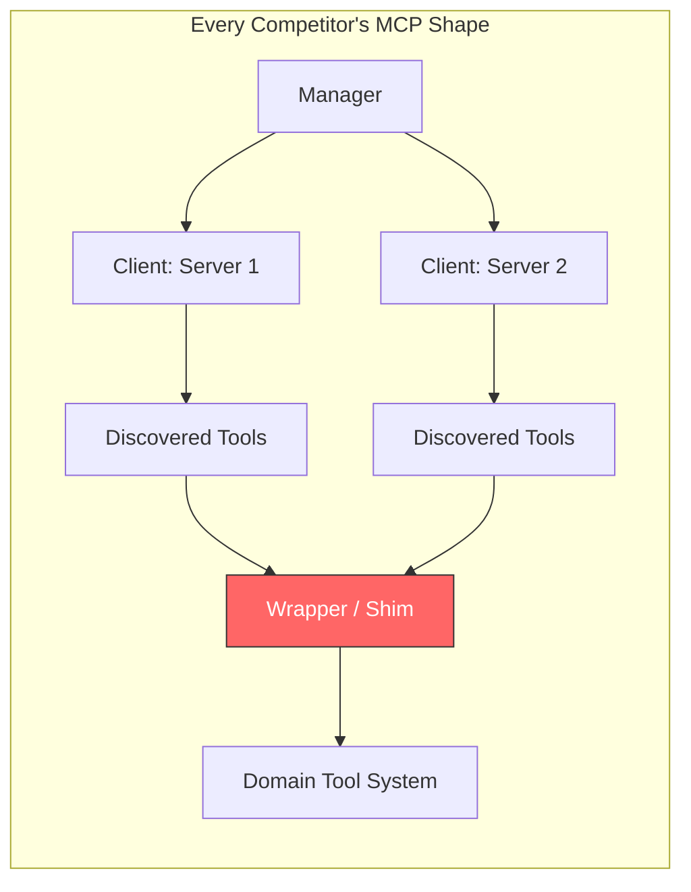
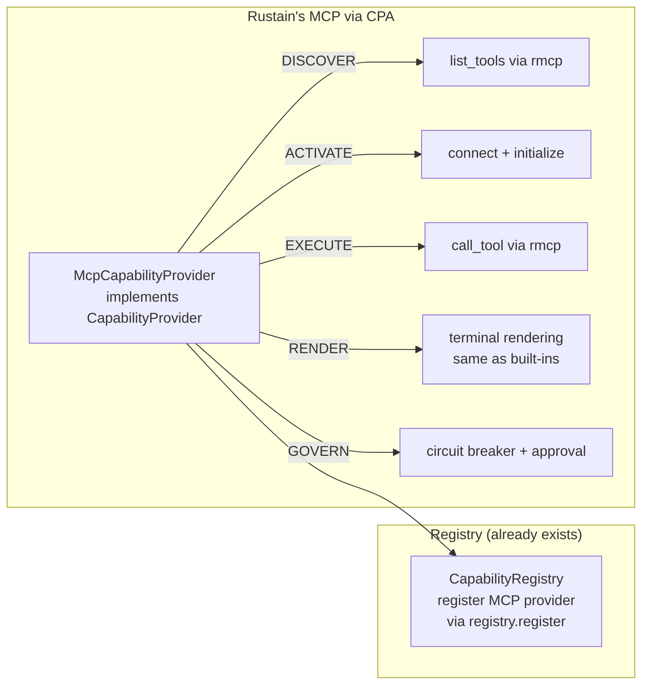
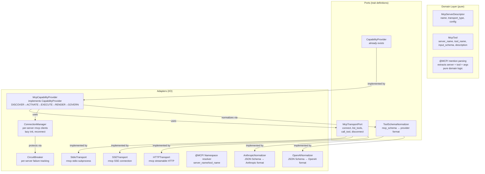
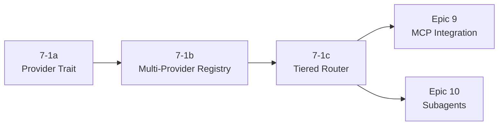

# Competitive Architecture Review — Epics 7 & 9

**Date:** 2026-04-30
**Scope:** Epic 7 (Multi-Provider Support & Cost Tracking) and Epic 9 (MCP Integration)
**Purpose:** Document findings from competitive analysis of six AI coding agent implementations, synthesize architectural recommendations for rustain, and capture open decisions.

**Sources analyzed:**

| Project | Language | Repo Path | Key Differentiator |
|---------|----------|-----------|-------------------|
| Codex-RS | Rust (~95 crates) | `codex/codex-rs/` | 3-layer provider hierarchy, `rmcp`-based MCP, comprehensive `TokenUsage` |
| Gemini-CLI | TypeScript | `gemini-cli/` | Chain-of-Responsibility model routing, `McpClientManager` with coalescing |
| OpenCode | TypeScript (Effect v4) | `opencode/` | 25+ providers via Vercel AI SDK, per-step `Decimal.js` cost tracking |
| KIMI | Rust (3 crates) | `KIMI/kimi-agent-rs/` | `AgentLaunchSpec.effective_model` 3-tier fallback, `ChatProvider` trait |
| OpenClaw | TypeScript (~133 plugins) | `openclaw/` | Plugin-driven `ProviderPlugin` interface, 60+ provider extensions |
| RustyCode | Rust (hexagonal) | `rustycode/` | 12 port traits, `McpClientPort`, `SchemaTransformer`, `LlmProvider` |

**Participants:** Winston (Architect), Amelia (Developer), Mary (Business Analyst)

---

## 1. Epic 7 — Multi-Provider Support & Cost Tracking

### 1.1 Requirements Covered

| FR | Description | Key Architectural Concern |
|----|-------------|--------------------------|
| FR33 | Switch model mid-conversation | Hot-swap via `ArcSwap`, model resolution pipeline |
| FR34 | Switch provider mid-conversation | Provider routing behind existing `ProviderPort` |
| FR35 | Model selector grouped by provider | `ModelDescriptor` with `provider_id` field |
| FR36 | Model registry with metadata | `ModelRegistryPort` — query models, get descriptors |
| FR37 | Local LLM provider support (Ollama) | Ollama adapter implementing `ProviderPort` |
| FR39 | Token usage ratio tracking | `TokenLedger` port, append-only JSONL |
| FR111 | Context window compaction | `ContextCompactor` domain service |
| FR114 | Cost tracking with budget limits | `PricingInfo × TokenUsage` calculation, `BudgetGuard` |
| 7.1c | Tiered model router + token tracking | `ModelTier` per-call resolution, flat-file ledger |

### 1.2 Competitor Patterns

Three architectural camps emerged from the analysis:

```
┌─────────────────────────────────────────────────────────────────┐
│                    Provider Architecture Camps                   │
├──────────────────┬──────────────────┬───────────────────────────┤
│ Camp 1: Traits   │ Camp 2: Plugins  │ Camp 3: SDK Wrapper       │
│ (Codex, Rusty)   │ (OpenClaw, KIMI) │ (OpenCode)                │
│                  │                  │                           │
│ Narrow port trait│ Manifest-driven  │ Thin layer over           │
│ → fat adapters   │ discovery        │ @ai-sdk/* packages        │
│                  │                  │                           │
│ Type-safe        │ Scales to 60+    │ Fast provider addition    │
│ Compile-time     │ providers        │ Ecosystem coupling risk   │
│ guarantees       │ Runtime failures │                           │
│                  │ possible         │                           │
├──────────────────┴──────────────────┴───────────────────────────┤
│ Recommendation for rustain: Camp 1 foundation                   │
│ (matches existing hexagonal ports)                              │
└─────────────────────────────────────────────────────────────────┘
```

### 1.3 Key Findings Per Competitor

#### Codex-RS — Layering Pattern (Take the shape, not the scale)

Codex uses a 3-layer separation that maps well to hexagonal thinking:

```
ModelProviderInfo (config struct)
    → ModelProvider trait (runtime port)
        → Provider (HTTP adapter)
```

The `ModelProviderInfo` holds serializable metadata (name, base URL, auth scheme, retry config). The `ModelProvider` trait is the runtime port with `info()`, `auth()`, `api_provider()`. The `Provider` struct handles HTTP request construction.

**Verdict:** The 3-layer separation is architecturally sound. But 95 crates is over-modularization — rustain should achieve the same separation in ~4 files per provider, not 4 crates.

**Auth chain pattern (deferred):** Codex resolves auth through a 4-method fallback: env var → config bearer → OAuth → command-backed. This is elegant but premature for rustain's v2.0. Note for future extraction when enterprise auth surfaces.

#### KIMI — 3-Tier Model Resolution (Take this pattern)

KIMI's `AgentLaunchSpec.effective_model` implements a deterministic fallback chain:

```rust
// Resolution: override → stored → default
fn resolve_effective_model(type_def, launch_spec) -> str {
    launch_spec.model_override
        .or(launch_spec.effective_model)
        .unwrap_or(type_def.default_model)
}
```

This is the exact pattern rustain needs for FR33/FR34. A domain value object `ResolvedModel` produced by a `ModelRouter` service that applies: (1) explicit user override (from `Ctrl+X, M` action), (2) persisted conversation model, (3) config default.

**Verdict:** Adopt directly. Clean, testable, deterministic.

#### OpenCode — Cost Precision (Take the principle)

OpenCode tracks costs per-step with `Decimal.js` for floating-point safety. Their cost model separates `input`, `output`, `reasoning`, `cache.read`, `cache.write` — five token categories. Costs are computed as `tokens × price_per_million` using exact arithmetic.

**Verdict:** In Rust, use `rust_decimal::Decimal` or newtype `Cost(Decimal)`. Never use `f64` for money. Store integer `u64` token counts in the ledger; compute costs at read time.

#### RustyCode — Hexagonal Peer (Learn from its mistakes)

RustyCode is rustain's closest architectural cousin: strict hexagonal, 12 port traits, `LlmProvider` port. However:

- **10 providers in a standalone `llm-provider` crate** is premature extraction — rustain should start with 2-3 providers in-tree and extract when the adapter interface stabilizes.
- **Cost tracking coupled to provider response** — token tracking should emit as a domain event (`TokensConsumed`), not live inside the adapter. The ledger adapter subscribes to the event.
- **Separate `McpClientPort` trait** — creates a parallel port when the existing `CapabilityProvider` already covers the lifecycle. This is a SRP/OCP concern (see Epic 9 analysis).

### 1.4 Recommended Architecture for Epic 7

```mermaid
graph TD
    subgraph "Domain Layer (pure, no I/O)"
        MD[ModelDescriptor<br/>id, provider_id, context_window,<br/>pricing, tier, capabilities]
        PD[ProviderDescriptor<br/>id, name, auth_scheme]
        MR[ModelRouter<br/>resolve: override → stored → default]
        MT[ModelTier<br/>Flagship | Standard | Economy | Local]
        TL[TokenLedger port<br/>write + query]
        BG[BudgetGuard<br/>checks ledger vs limits]
        CC[ContextCompactor<br/>domain service]
        TU[TokenUsage<br/>input, output, cached, reasoning]
        PI[PricingInfo<br/>per-model cost rates]
    end

    subgraph "Ports (trait definitions)"
        PP[ProviderPort<br/>stream_completion, abort, provider_id<br/><i>already exists</i>]
        MRP[ModelRegistryPort<br/>list_by_provider, get_metadata, resolve]
    end

    subgraph "Adapters (I/O implementations)"
        AA[AnthropicAdapter<br/>implements ProviderPort]
        OA[OpenAIAdapter<br/>implements ProviderPort]
        OLA[OllamaAdapter<br/>implements ProviderPort]
        PR[ProviderRouter<br/>implements ProviderPort<br/>routes via ModelRegistry]
        SR[StaticRegistryAdapter<br/>reads from config/TOML]
        FL[FlatFileLedgerAdapter<br/>JSONL append-only]
    end

    PR -->|delegates to| AA
    PR -->|delegates to| OA
    PR -->|delegates to| OllamaAdapter
    PR -->|resolves via| MRP
    MRP -->|implemented by| SR
    TL -->|implemented by| FL
    MR -->|uses| MRP
    BG -->|reads| TL
```

**New domain types:**

| Type | Location | Purpose |
|------|----------|---------|
| `ModelDescriptor` | `src/domain/models/provider.rs` (new) | Value object: id, provider_id, context_window, pricing, tier, capabilities |
| `ProviderDescriptor` | same file | Value object: id, name, auth_scheme, base_url |
| `ModelTier` | same file | Enum: `Flagship`, `Standard`, `Economy`, `Local` |
| `PricingInfo` | same file | Cost rates per token category |
| `TokenUsage` | extend `src/domain/models/usage.rs` | Add `reasoning_tokens`, `total_tokens` fields |
| `ResolvedModel` | `src/domain/services/model_router.rs` (new) | Output of model resolution |

**New ports:**

| Port | Location | Methods |
|------|----------|---------|
| `ModelRegistryPort` | `src/domain/ports/model_registry.rs` (new) | `resolve(ModelRequest) → ResolvedModel`, `list_by_provider()`, `get_metadata()` |

**Key design decisions:**

1. **Route through existing `ProviderPort`.** The `ProviderRouter` adapter implements the same `ProviderPort` trait already used by `main.rs`. It holds an `ArcSwap<HashMap<ProviderId, Box<dyn ProviderPort>>>` and delegates. No second provider abstraction — the existing trait is sufficient. When the user switches providers, the router updates its active delegate. The event loop sees no change.

2. **`ModelRouter` is a pure domain service.** No I/O. It takes a `ModelRequest` and a `ModelRegistryPort` and produces a `ResolvedModel`. The 3-tier cascade (override → stored → default) mirrors KIMI's proven pattern.

3. **Token tracking via domain events.** After each `ProviderPort::stream_completion()` call, the infrastructure emits a `TokensConsumed` event (a variant of the existing `AppEvent`). The `FlatFileLedgerAdapter` subscribes and appends to JSONL. Decoupled from the provider adapter.

4. **Append-only JSONL ledger.** One entry per LLM call: `{timestamp, conversation_id, model_id, input_tokens, output_tokens, cached_tokens, reasoning_tokens}`. The `TokenLedger` port abstracts storage so a future SQLite swap touches zero domain code.

5. **Cost as a pure function.** `PricingInfo` (from `ModelDescriptor`) × `TokenUsage` = `Cost`. Use `rust_decimal::Decimal`. No separate cost service — this is a method on a value object or a free function.

### 1.5 File Map

```
src/domain/
  models/
    provider.rs          ← NEW: ModelDescriptor, ProviderDescriptor, ModelTier, PricingInfo
  services/
    model_router.rs      ← NEW: pure domain service, 3-tier resolution
    budget_guard.rs      ← NEW: checks TokenLedger against BudgetPolicy
    context_compactor.rs ← NEW: FR111 compaction logic
  ports/
    model_registry.rs    ← NEW: ModelRegistryPort trait
    token_ledger.rs      ← NEW: TokenLedger port trait (write + query)
  events.rs              ← EXTEND: add TokensConsumed variant to AppEvent

src/adapters/
  provider/
    mod.rs               ← NEW: ProviderRouter implementing ProviderPort
    anthropic.rs         ← EXISTING (refactored from current single adapter)
    openai.rs            ← NEW: OpenAI-compatible adapter
    ollama.rs            ← NEW: local LLM adapter (FR37)
  registry/
    static_registry.rs   ← NEW: reads model catalog from TOML config
  ledger/
    flat_file.rs         ← NEW: JSONL append-only TokenLedger adapter

src/infrastructure/
  runtime/
    agent_core.rs        ← EXTEND: wire ProviderRouter into event loop
```

---

## 2. Epic 9 — MCP Integration

### 2.1 Requirements Covered

| FR | Description | Key Architectural Concern |
|----|-------------|--------------------------|
| FR20 | MCP tools via `@MCP/` mention | `@MCP/server_name/tool_name` parsing |
| FR45 | Connect to MCP tool servers (stdio/SSE/HTTP) | `McpTransportPort` with 3 transport adapters |
| FR47 | Uniform capability provider rendering | CPA `RENDER` phase — free if MCP goes through `CapabilityProvider` |
| FR48 | Extensible interop provider registration | `CapabilityProvider` registry — already exists |

### 2.2 The Critical Insight: MCP Is Just Another CapabilityProvider

Every competitor treats MCP tools as second-class citizens. They wrap them, translate them, shim them:

- **OpenCode:** `dynamicTool()` merges MCP tools with builtins
- **Gemini-CLI:** `DiscoveredMCPTool` wraps as `BaseDeclarativeTool`
- **RustyCode:** Separate `McpClientPort` trait creates a parallel port
- **OpenClaw:** Three distinct MCP server modes

All of these introduce an impedance mismatch between MCP tools and the rest of the system.

**Rustain already has the answer.** The `CapabilityProvider` trait with `DISCOVER → ACTIVATE → EXECUTE → RENDER → GOVERN` maps directly to the MCP lifecycle:

```
DISCOVER  → rmcp list_tools
ACTIVATE  → rmcp connect + initialize (lazy, on first @MCP/ mention)
EXECUTE   → rmcp call_tool
RENDER    → terminal rendering (same as built-in tools)
GOVERN    → timeout, circuit breaker, approval gating
```

This means FR47 (uniform rendering) and FR48 (extensible registration) are **architectural properties, not features to build.** MCP tools render identically to built-in tools because they share the same lifecycle. New protocols (A2A, future ones) register the same way.

### 2.3 Competitor Patterns



The red node is where every competitor introduces friction — an adapter layer that converts MCP tools into whatever the domain expects.

**Rustain's alternative:**



No wrapper. No shim. The MCP provider implements the same trait as Skills and future A2A agents.

### 2.4 Key Findings Per Competitor

#### Codex-RS — Lazy Init + Naming (Take both)

Codex's `McpConnectionManager` owns one `RmcpClient` per configured MCP server, keyed by server name. Connections are lazily initialized — first tool call targeting a server triggers connection. This is critical for local development where MCP servers may not be running at startup.

Tool naming uses `mcp__server__tool` disambiguation. For rustain, this maps to the `@MCP/server_name/tool_name` mention syntax (FR20).

**Verdict:** Adopt lazy init and namespaced naming.

#### RustyCode — Circuit Breaker + SchemaTransformer (Take both)

RustyCode's `McpClientAdapter` uses a circuit breaker per MCP server — when a server fails repeatedly, subsequent calls short-circuit to error without attempting connection. This is essential for production resilience.

The `SchemaTransformer` trait converts MCP JSON Schema to LLM-specific tool schemas (Anthropic vs OpenAI format). This is a real problem: every LLM provider has slightly different tool schema expectations. When the user switches providers mid-conversation (FR34), tool schemas must be re-normalized.

**Verdict:** Circuit breaker per server is non-negotiable. `SchemaTransformer` (renamed `ToolSchemaNormalizer`) handles the format conversion.

#### KIMI — Bridge Pattern (Confirm the approach)

KIMI's `McpTool` wraps an MCP tool as `CallableTool` — a thin adapter translating MCP's protocol into the domain's tool interface. This is exactly the pattern rustain needs, except the target trait is `CapabilityProvider` instead of `CallableTool`.

**Verdict:** Confirms the `McpCapabilityProvider` approach.

#### Gemini-CLI — OAuth Discovery (Note for future)

Gemini-CLI implements OAuth with automatic discovery from `WWW-Authenticate` headers — enterprise MCP servers that require authentication can be handled without manual token management.

**Verdict:** Defer to post-v2.0. The `McpTransportPort` abstracts this so OAuth transport can be added as a new adapter without touching domain.

### 2.5 Recommended Architecture for Epic 9



**New domain types:**

| Type | Location | Purpose |
|------|----------|---------|
| `McpServerDescriptor` | `src/domain/models/mcp.rs` (new) | Value object: name, transport config |
| `McpTool` | same file | Value object: server_name, tool_name, input_schema |

**New ports:**

| Port | Location | Purpose |
|------|----------|---------|
| `McpTransportPort` | `src/domain/ports/mcp_transport.rs` (new) | I/O boundary for MCP protocol |
| `ToolSchemaNormalizer` | `src/domain/ports/schema_normalizer.rs` (new) | MCP JSON Schema → provider format |

**Note:** `McpCapabilityProvider` is an *adapter*, not a port. It implements the existing `CapabilityProvider` trait. No new port needed for MCP's domain lifecycle — the CPA trait already defines it.

### 2.6 File Map

```
src/domain/
  models/
    mcp.rs                ← NEW: McpServerDescriptor, McpTool value objects
  ports/
    mcp_transport.rs      ← NEW: McpTransportPort trait (connect, list_tools, call_tool, disconnect)
    schema_normalizer.rs  ← NEW: ToolSchemaNormalizer trait
  services/
    mcp_mention_parser.rs ← NEW: @MCP/server/tool parsing (pure domain logic)

src/adapters/
  mcp/
    mod.rs                ← NEW: McpCapabilityProvider implementing CapabilityProvider
    connection_manager.rs ← NEW: per-server rmcp clients, lazy initialization
    transport/
      stdio.rs            ← NEW: StdioTransport (rmcp subprocess)
      sse.rs              ← NEW: SSETransport (rmcp SSE)
      http.rs             ← NEW: HTTPTransport (rmcp streamable HTTP)
    circuit_breaker.rs    ← NEW: per-server circuit breaker
    namespace.rs          ← NEW: @MCP/ mention resolution
    schema/
      anthropic.rs        ← NEW: Anthropic tool schema normalizer
      openai.rs           ← NEW: OpenAI tool schema normalizer
```

---

## 3. Cross-Epic Intersections

### 3.1 Schema Normalization on Provider Switch

When the user switches providers mid-conversation (FR34 via `Ctrl+X, M`), the active provider's expected tool schema format changes. MCP tool schemas must be re-normalized.

**Wire this through `ArcSwap`.** The composition root holds `ArcSwap<dyn ToolSchemaNormalizer>` that updates when the provider switches. The `McpCapabilityProvider` reads the normalizer at `DISCOVER` time. This keeps the cross-cutting concern out of the domain.

### 3.2 Token Accounting for MCP Tool Calls

If an MCP tool invocation triggers a downstream LLM call (e.g., an MCP server that itself calls an LLM), that's the MCP server's responsibility. But the *triggering* LLM call's token count should account for the MCP tool's output in the context window.

The `TokenLedger` should tag entries with `trigger: "mcp_tool:{server}/{tool}"` for cost attribution analysis.

### 3.3 Epic Ordering

Epic 9 depends on Epic 7's `ModelRegistry` for subagent model resolution. Story 7.1c ships before Epic 9 begins.



---

## 4. What to Adopt, What to Reject

### 4.1 Adopt

| Source | Pattern | Reason |
|--------|---------|--------|
| **Codex-RS** | 3-layer provider separation (config → trait → adapter) | Sound hexagonal mapping |
| **Codex-RS** | Lazy MCP initialization (connect on first use) | Essential for local dev ergonomics |
| **Codex-RS** | `mcp__server__tool` namespaced naming | Adapts to `@MCP/server/tool` mention syntax |
| **Codex-RS** | `TokenUsage { input, cached, output, reasoning, total }` | Comprehensive token tracking |
| **KIMI** | 3-tier model fallback (override → stored → default) | Deterministic, testable resolution |
| **KIMI** | `McpTool → CallableTool` bridge pattern | Confirms CPA approach |
| **OpenCode** | Decimal-precision cost tracking | Floating-point money is a bug |
| **OpenCode** | Per-step token accounting with cache breakdown | Granular cost visibility |
| **RustyCode** | Circuit breaker per MCP server | Production resilience |
| **RustyCode** | `SchemaTransformer` for tool schema normalization | Handles provider differences |
| **RustyCode** | Hexagonal port/adapter for all MCP concerns | Matches rustain's architecture |

### 4.2 Reject

| Source | Pattern | Reason |
|--------|---------|--------|
| **Codex-RS** | 95-crate workspace | Over-modularization without benefit |
| **Codex-RS** | 4-method auth chain | Premature for v2.0 |
| **Gemini-CLI** | Chain of Responsibility routing (5 interceptors) | Enterprise ceremony for a single-user terminal agent |
| **Gemini-CLI** | 3835-line `Config` god class | Anti-pattern; rustain uses layered TOML |
| **Gemini-CLI** | `DiscoveredMCPTool` wrapping as `BaseDeclarativeTool` | TypeScript class hierarchy noise; Rust favors composition |
| **OpenClaw** | 133-plugin manifest system | Premature extensibility; CPA trait already provides extension point |
| **OpenClaw** | Three MCP modes (channel server, tools server, plugin tools server) | Rustain is a terminal agent, not a platform |
| **OpenCode** | Effect v4 service pattern | TypeScript-native; rustain uses Rust traits |
| **OpenCode** | Vercel AI SDK dependency | Strategic coupling to another project's ecosystem |
| **RustyCode** | 10-provider standalone crate | Premature extraction; start in-tree |
| **RustyCode** | Separate `McpClientPort` trait | Duplicates `CapabilityProvider` lifecycle; violates OCP |

---

## 5. Open Decisions

The following questions require product-level input before story creation:

### 5.1 Budget Enforcement (FR114)

**Question:** Should budget enforcement be hard-block (stop the conversation when budget is exceeded) or soft-warn (notify but continue)?

| Option | Architecture Impact |
|--------|-------------------|
| **Hard-block** | `BudgetGuard` becomes a gate in the streaming pipeline — checks ledger before each `ProviderPort::stream_completion()` call. Returns `DomainError::BudgetExceeded`. |
| **Soft-warn** | `BudgetGuard` is a notification emitter — publishes `AppEvent::BudgetWarning` that the TUI renders as a `FeedbackBlock`. Conversation continues. |

**Recommendation (Winston):** Hard-block with a configurable threshold. Default at 95% budget triggers warning; 100% blocks. This gives the user a grace zone while preventing runaway costs.

### 5.2 MCP Approval Granularity (FR20)

**Question:** Should MCP tool approval be gated per-server or per-tool?

| Option | UX Impact | Implementation |
|--------|-----------|----------------|
| **Per-server** | Trust a server → all its tools are auto-approved. Simpler UX. | `GOVERN` phase checks `McpServerDescriptor.trust_level` |
| **Per-tool** | Approve each tool individually. More control, more clicks. | `GOVERN` phase checks per-tool allowlist |
| **Per-server with overrides** | Default trust per server, but specific tools can be denied. Best of both. | Two-level check: server trust → tool denylist |

**Recommendation (Amelia):** Per-server with a trust level config. Keeps the UX simple while allowing power users to deny specific tools.

### 5.3 Model Switching Granularity (FR33/FR34)

**Question:** Should model switching happen per-turn or per-step within a turn?

| Option | Scope | Complexity |
|--------|-------|-----------|
| **Per-turn** | Model is resolved once at the start of each user turn. Covers 90% of cases. | `ModelRouter.resolve()` called once per `AgentThenSubmit` event. |
| **Per-step** | Model can change mid-turn (e.g., escalate from Economy to Flagship for a complex tool call). | `ModelRouter.resolve()` called per LLM invocation within the tool loop. Cost attribution per-step. |

**Recommendation (Mary):** Per-turn for v2.0. The architecture does not preclude per-step later — `ModelRouter.resolve()` can be called at any granularity. Per-step is a v2.5+ concern driven by actual usage data from the token ledger.

---

## 6. Consensus Matrix

| Topic | Winston | Amelia | Mary | Consensus |
|-------|---------|--------|------|-----------|
| Route through existing `ProviderPort` | Yes | Yes | Yes | **Unanimous** |
| 3-tier model resolution (KIMI pattern) | Yes | Yes | Yes | **Unanimous** |
| MCP through `CapabilityProvider` | Yes | Yes | Yes | **Unanimous** |
| Circuit breaker per MCP server | Yes | Yes | Yes | **Unanimous** |
| `rust_decimal` for cost precision | Yes | Yes | Yes | **Unanimous** |
| `rmcp` crate for MCP protocol | Yes | Yes | Yes | **Unanimous** |
| Lazy MCP initialization | Yes | Yes | Yes | **Unanimous** |
| Append-only JSONL token ledger | Yes | Yes | Yes | **Unanimous** |
| New `ModelRegistryPort` | Yes | Yes | Yes | **Unanimous** |
| New `McpTransportPort` | Yes | Partial (prefers keeping it adapter-internal) | Yes | **Strong majority** |
| Separate `ProviderFactoryPort` | Yes | No (use existing `ProviderPort` only) | Yes | **Split** |
| Per-server MCP approval | — | Yes | — | Pending product input |
| Hard-block budget enforcement | Yes | — | — | Pending product input |
| Per-turn model switching | — | — | Yes | Pending product input |

### Key Disagreement: `McpTransportPort` vs Adapter-Internal

**Winston & Mary** propose `McpTransportPort` as a formal port trait in `src/domain/ports/`. This makes transport swappable at the domain level and supports testability via mock transports.

**Amelia** argues that transport is purely I/O and should stay adapter-internal — the domain only needs to know about `McpServerDescriptor` and `McpTool`. The `McpCapabilityProvider` adapter encapsulates transport choice.

**Resolution:** Adopt Winston's position. A port trait enables conformance testing (rustain's established pattern) and allows the existing `noop.rs` stub pattern for stories that haven't implemented MCP yet. The cost is one file (`src/domain/ports/mcp_transport.rs`); the benefit is testability and consistency with the other 14 ports already in `src/domain/ports/`.

---

## 7. Scope Estimate

| Metric | Epic 7 | Epic 9 | Total |
|--------|--------|--------|-------|
| New domain types | 6 | 2 | 8 |
| New port traits | 2 | 2 | 4 |
| New adapter files | 7 | 11 | 18 |
| Extended existing files | 3 | 0 | 3 |
| Estimated new LOC | ~800 | ~600 | ~1400 |

Both epics stay within rustain's existing module structure. No new crates, no workspace splits. Every new file maps to a specific FR requirement.

---

## Appendix A — Current Rustain Ports (Reference)

The following ports exist in `src/domain/ports/` as of 2026-04-30:

| Port | File | Status |
|------|------|--------|
| `ProviderPort` | `provider.rs` | Active — streaming LLM completions |
| `ToolSetPort` | `toolset.rs` | Active — tool discovery and execution |
| `ApprovalPersistencePort` | `approval_persistence.rs` | Active |
| `ChannelPort` | `channel.rs` | Stub (Epic 12) |
| `ClipboardPort` | `clipboard.rs` | Active |
| `ContextPort` | `context.rs` | Active |
| `EventEmitterPort` | `event_emitter.rs` | Active |
| `MemoryPort` | `memory.rs` | Stub (Epic 11) |
| `PersonaPort` | `persona.rs` | Active |
| `SchedulerPort` | `scheduler.rs` | Stub (Epic 11) |
| `SecurityPort` | `security.rs` | Active |
| `SessionPort` | `session_port.rs` | Active |
| `StoragePort` | `storage.rs` | Active |

**Proposed additions for Epics 7 & 9:**

| New Port | File | Epic |
|----------|------|------|
| `ModelRegistryPort` | `model_registry.rs` | 7 |
| `TokenLedgerPort` | `token_ledger.rs` | 7 |
| `McpTransportPort` | `mcp_transport.rs` | 9 |
| `ToolSchemaNormalizer` | `schema_normalizer.rs` | 9 |

## Appendix B — Current Rustain Domain Models (Reference)

Key models in `src/domain/models/` relevant to Epics 7 & 9:

| Model | File | Relevance |
|-------|------|-----------|
| `UsageInfo` | `usage.rs` | **Extend** — add `reasoning_tokens`, `total_tokens` |
| `ModelInfo` | `usage.rs` | **Extend** — add `provider_id`, `pricing`, `tier`, `capabilities` |
| `StreamChunk` | `stream.rs` | Already carries token usage from provider |
| `ToolDefinition` | `tools.rs` | MCP tools surface as `ToolDefinition` after normalization |
| `palette.rs` | `palette.rs` | `PaletteAction::SwitchModel` stub already exists (Epic 7) |

## Appendix C — Competitor Architecture Comparison Matrix

### Provider Architecture

| | Codex-RS | Gemini-CLI | OpenCode | KIMI | OpenClaw | RustyCode |
|---|---|---|---|---|---|---|
| **Provider count** | 3 | 1 (Google) | 25+ | 1 (Kimi) | 60+ | 10 |
| **Abstraction** | 3-layer trait hierarchy | `ContentGenerator` interface | Vercel AI SDK `@ai-sdk/*` | `ChatProvider` trait | `ProviderPlugin` manifest | `LlmProvider` port trait |
| **Hot-swap** | Per-thread model | No (single provider) | Per-session | Per-agent | Per-request | Via DI container rebuild |
| **Auth** | 4-method chain | Google OAuth/API key | Per-provider SDK | Env var per provider | Plugin hook `prepareRuntimeAuth` | Per-adapter |
| **Cost tracking** | `TokenUsage` + analytics events | Basic token count | `Decimal.js` per-step | Basic | Per-model pricing + usage auth hooks | `CostTrackingService` |
| **Crate/file count** | ~95 crates | Monolith | Monorepo packages | 3 crates | 133 extensions | 5 crates |

### MCP Architecture

| | Codex-RS | Gemini-CLI | OpenCode | KIMI | OpenClaw | RustyCode |
|---|---|---|---|---|---|---|
| **SDK** | `rmcp` | `@modelcontextprotocol/sdk` | `@modelcontextprotocol/sdk` | `rmcp` | `@modelcontextprotocol/sdk` | `rmcp` |
| **Transports** | Stdio, HTTP (streamable) | Stdio, SSE, HTTP | Stdio, HTTP/SSE | Stdio, HTTP | Stdio, HTTP | Stdio, SSE, HTTP |
| **Tool naming** | `mcp__server__tool` | `mcp_{server}_{tool}` | `{client}_{tool}` | Per-tool registration | Via plugin hooks | Configurable namespace strategy |
| **Resilience** | Session recovery | Coalescing notifications | Reconnection | Approval gating, timeouts | Plugin hooks | Circuit breaker per server |
| **Auth** | Elicitation with auto-approval | OAuth from WWW-Authenticate | OAuth 2.0 dynamic registration | OAuth with `AuthorizationManager` | Plugin auth hooks | OAuth token management |
| **Lazy init** | Yes | Yes | Yes (per Effect service) | Yes | Plugin lifecycle | Yes |
