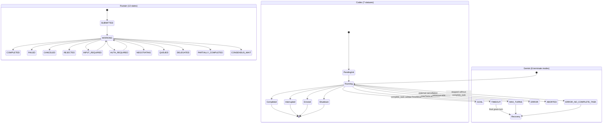
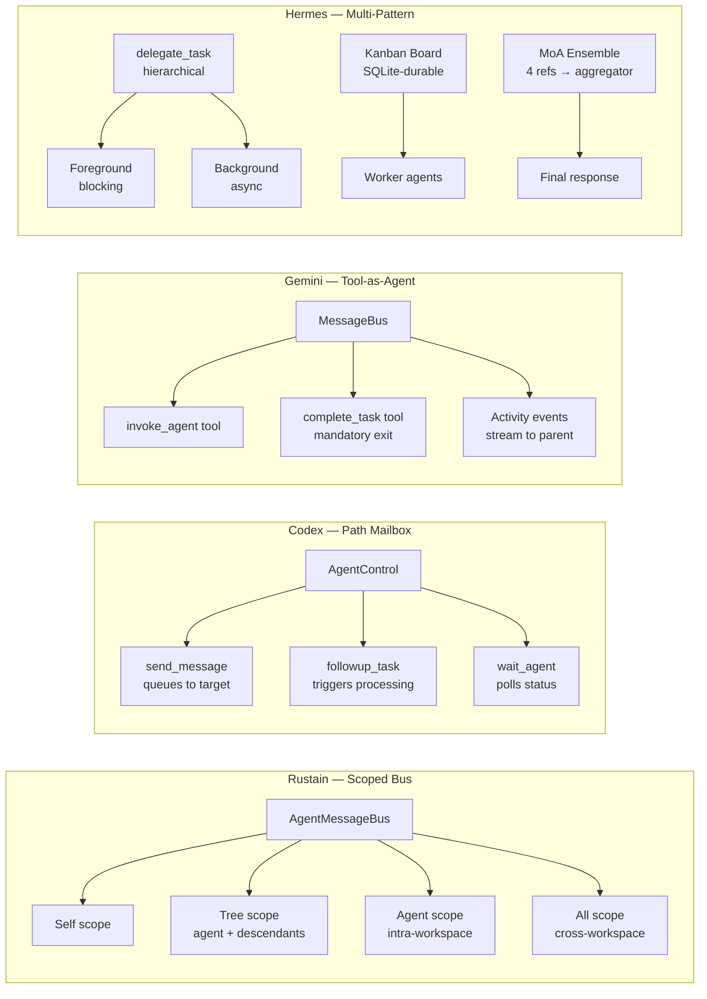
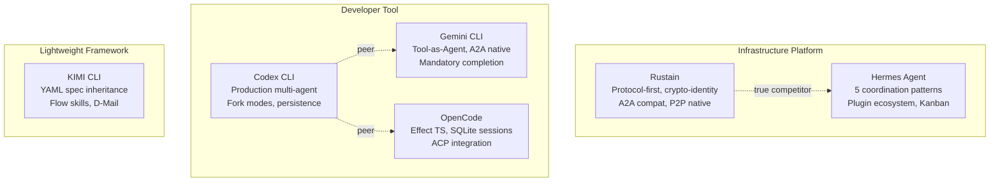

# Sub-Agent Architecture Comparison — Rustain vs. Competitors

**Date:** 2026-05-27
**Scope:** End-to-end comparison of sub-agent architecture across six agent platforms
**Audience:** Rustain core team — internal architecture decision reference
**Methodology:** Source-code-level analysis of all six codebases with BMAD party-mode roundtable (Winston / Architect, Amelia / Dev, Mary / Analyst). Hermes Agent was analyzed separately from the Epic 7–14 competitive reviews; see `/hermes-agent/`.

**Projects analyzed:**

| Project | Language | Sub-Agent Model | A2A Support | Maturity |
|---------|----------|-----------------|-------------|----------|
| **Rustain (RAP)** | Rust | Hexagonal ports-and-adapters, Capability Token delegation | A2A v1.0 compat adapter (planned) | Pre-implementation |
| **OpenAI Codex CLI** | Rust | Hierarchical actor tree, AgentPath addressing | No — custom protocol | Production (V1 stable, V2 in dev) |
| **Google Gemini CLI** | TypeScript | Sub-agents-as-tools (AgentTool), AgentProtocol interface | Yes — `@a2a-js/sdk` + experimental server | Production |
| **OpenCode** | TypeScript (Effect TS) | Session-tree with parentID, task tool | No — ACP for clients only | Production |
| **KIMI CLI** | Python | YAML spec inheritance, foreground/background dual-path | No — custom Wire protocol | Production |
| **Hermes Agent** | Python | ThreadPoolExecutor delegation, Kanban board, MoA ensemble | No — ACP adapter | Production |

**Participants:** Winston (Architect), Amelia (Senior Dev), Mary (Business Analyst)

---

## 1. Executive Summary

Six projects, three strategic tiers. Rustain's true competitor is **Hermes** — both aim to be agent orchestration platforms. Codex, Gemini, OpenCode, and KIMI are coding assistants with multi-agent extensions.

**Consensus of the roundtable (3/3 agents agree):**

1. Rustain's Capability Token lattice-subset delegation is the **right concept** at the wrong scope — reduce `max_depth` from 8 to 3 for R1
2. Codex CLI has the **most mature implementation** — path-based addressing, fork modes, and persistence are production-proven
3. Gemini's mandatory `complete_task` and 2-level flat hierarchy offer the **best testability**
4. Hermes' five coordination patterns (delegation, Kanban, MoA, gateway, ACP) represent the **broadest operational maturity**
5. Rustain's 13-state TaskState machine should ship with **8 A2A states only in R1**; defer 5 P2P states to R2

**Key disagreement:** Winston considers Rustain "exciting — and that's concerning." Mary counters that Hermes is *more* ambitious *and* more mature, so the risk is verification latency, not concept overreach. Amelia sides with Mary on the Capability Token concept but agrees with Winston on scope reduction.

**Strategic context:** Rustain builds RAP (Rustain Agent Protocol) rather than adopting A2A natively — a peer-native, crypto-first, transport-agnostic protocol with an A2A v1.0 compatibility adapter (`rap-a2a-compat`). The A2A ecosystem is immature (v1.0 released April 2026, official Rust SDK `a2a-lf` at v0.1.x with no production deployments), giving Rustain a 12–18 month window to capture the standards-compliant platform position. See companion documents: `a2a-protocol-critique.md`, `rap-protocol-design.md`, `a2a-libraries-sdks-comparison.md`.

---

## 2. Identity & Security Model

### 2.1 Comparison Matrix

| Project | Identity Primitive | Permission Model | Delegation Mechanism | Max Depth | Cryptographic Proofs |
|---------|-------------------|------------------|---------------------|-----------|---------------------|
| **Rustain** | `PeerIdentity` (Ed25519 pubkey + multihash peer_id) | Capability Token with lattice-subset enforcement | `CapabilityProvider::delegate()` mints child tokens | 8 (configurable) | Ed25519 signatures on every envelope, JWS-EdDSA on AgentCards |
| **Codex** | `ThreadId` / `AgentPath` | Config inheritance + `max_threads` resource cap | No explicit permission delegation — child inherits parent config | Unlimited (tree) | None |
| **Gemini** | `AgentDefinition` (local or remote) | Tool isolation + recursion block | Sub-agent gets cloned tool registry; agent tools filtered out | 2 (flat) | None (local); A2A auth for remote |
| **OpenCode** | `Agent.Info` schema (name, mode, permission ruleset) | Parent restriction inheritance + hardcoded deny list | `deriveSubagentSessionPermission()` merges parent + sub-agent rules | 1 (parent→child) | None |
| **KIMI** | YAML spec (name, tools, subagents map) | Shared `Approval` + `ApprovalRuntime` | `Runtime.copy_for_{fixed,dynamic}_subagent()` with distinct isolation policies | 1 (root only) | None |
| **Hermes** | `AIAgent` init params (60+ fields) | Progressive tool restriction per level | `delegate_task` intersects parent toolset, strips blocked tools | 1–3 (configurable) | None |

### 2.2 Analysis

**Rustain is the only project with cryptographic identity and verifiable permission delegation.** This is not over-engineering — it is the entry requirement for security-compliant enterprise deployments.

The lattice-subset invariant is property-testable:

```
forall parent_token, child_token in delegations:
  assert child_token.capabilities ⊂ parent_token.capabilities
  assert child_token.depth < parent_token.depth
```

No other project can make this guarantee. Codex has resource limits (`max_threads`) but no permission semantics. Gemini achieves security through structural constraint (2-level only). Hermes relies on progressive tool stripping.

**Recommendation (Amelia):** Keep the Capability Token model. Reduce `max_depth` from 8 to 3 for R1. The concept is correct; the scope needs trimming.

### 2.3 Security Model Diagram

```mermaid
graph TB
    subgraph Rustain
        R0[Root PeerIdentity<br/>Ed25519 + AgentCard] -->|CapabilityToken<br/>lattice-subset| R1[Worker depth=1]
        R1 -->|CapabilityToken<br/>subset of depth=1| R2[Worker depth=2]
        R2 -->|CapabilityToken<br/>subset of depth=2| R3[Worker depth=3]
    end

    subgraph Codex
        C0["/root (ThreadId)"] -->|inherit config| C1["/root/task1"]
        C1 -->|inherit config| C2["/root/task1/worker"]
        C2 -->|inherit config| C3["...unlimited"]
    end

    subgraph Gemini
        G0[Main Agent] -->|cloned tools,<br/>recursion blocked| G1[Sub-Agent]
        G1 -.->|BLOCKED| G2[No further nesting]
    end

    subgraph Hermes
        H0[Parent AIAgent] -->|delegate_task<br/>tool intersection| H1[Leaf depth=1]
        H0 -->|delegate_task<br/>role=orchestrator| H2[Orchestrator depth=1]
        H2 -->|delegate_task<br/>stripped tools| H3[Leaf depth=2]
    end

    style R0 fill:#4a9,color:#fff
    style G2 fill:#e74,color:#fff
    style C3 fill:#888,color:#fff
```



---

## 3. Spawning & Lifecycle

### 3.1 Comparison Matrix

| Project | Spawn Trigger | Spawn Mechanism | Fork/History | Lifecycle States | Termination |
|---------|--------------|-----------------|--------------|------------------|-------------|
| **Rustain** | Orchestrator via `SubAgentRegistry::spawn(spec)` | `CapabilityProvider::delegate()` → child token in first envelope | N/A (fresh context) | 13 states (8 A2A + 5 P2P) | COMPLETED / FAILED / CANCELED / REJECTED |
| **Codex** | Model calls `spawn_agent` tool | `AgentControl::spawn_agent_with_metadata()` → new CodexThread | FullHistory / None / LastNTurns(N) | 7 statuses (PendingInit → Running → Completed/Interrupted/Errored/Shutdown) | Completion watcher injects message to parent |
| **Gemini** | Model calls `invoke_agent` tool | `LocalAgentExecutor.create()` → isolated registries | N/A (fresh context) | 6 terminate modes (ERROR/TIMEOUT/GOAL/MAX_TURNS/ABORTED/ERROR_NO_COMPLETE_TASK) | Mandatory `complete_task` call; recovery turn on timeout |
| **OpenCode** | Model calls `task` tool | Child session created with `parentID` in SQLite | N/A (fresh context) | idle / busy / retry (session run state) | Max steps enforcement → text-only final response |
| **KIMI** | Model calls `Agent` tool | `ForegroundSubagentRunner` or `BackgroundAgentRunner` | Resume via `resume` param (continues JSONL context) | 6 statuses (idle/running_foreground/running_background/completed/failed/killed) | Summary continuation if result < 200 chars |
| **Hermes** | Model calls `delegate_task` tool | `ThreadPoolExecutor` → `_build_child_agent()` | N/A (fresh context) | Implicit (loop iterations) | Hard timeout (600s default) + heartbeat stale detection |

### 3.2 Analysis

**Codex has the most sophisticated spawning model.** Three key features stand out:

1. **Fork modes** — `FullHistory` gives the child complete parent context (minus tool calls), `LastNTurns(N)` gives the tail, `None` starts fresh. This is the only project that offers graduated context inheritance.
2. **Persistence** — Rollout files + spawn edges enable full agent tree reconstruction after crashes.
3. **Nickname system** — 101 scientist names (`agent_names.txt`) assigned randomly. Trivial but humanizing.

**Gemini's mandatory `complete_task`** is the strongest termination guarantee. Sub-agents *must* call it to exit — the loop does not terminate on empty responses. The recovery turn (1-minute grace period) is a thoughtful fallback for timeout/max-turns scenarios.

**KIMI's foreground/background dual path** is the most flexible execution model. Foreground blocks the root (synchronous, relays wire events). Background runs as `asyncio.Task` (returns immediately, injects result later). Both paths share the same `Agent` tool interface.

**Rustain's `SubAgentRegistry` trait** is architecturally clean (hexagonal port) but unimplemented. The `reconstruct` method on `AgentExecutor` (absorbed from Gemini's pattern) shows awareness of persistence needs.

### 3.3 Lifecycle State Machines



**Recommendation (all three agents):** Ship R1 with 8 A2A-compatible states only. The 5 P2P states (`NEGOTIATING`, `QUEUED`, `DELEGATED`, `PARTIALLY_COMPLETED`, `CONSENSUS_WAIT`) are R2 concerns. This reduces Amelia's test matrix by ~60%.

---

## 4. Communication & Messaging

### 4.1 Comparison Matrix

| Project | Communication Primitive | Broadcast Support | Message Envelope | Ordering Guarantee |
|---------|------------------------|-------------------|-----------------|-------------------|
| **Rustain** | `AgentMessageBus` (send/broadcast/subscribe) | Yes — 4 VisibilityScopes (Self/Tree/Agent/All) | `AgentEnvelope` (Ed25519 signed, monotonic seq, TTL, content hash) | Per-sender monotonic sequence + dedup |
| **Codex** | `InterAgentCommunication` (V2) / `Op::UserInput` injection (V1) | No — unicast only | `Op` enum with typed variants | Submission queue (bounded channel) |
| **Gemini** | `MessageBus` (derived per sub-agent) | No — activity streaming via `SubagentActivityEvent` | `AgentEvent` typed events | Stream-ordered (per streamId) |
| **OpenCode** | Session hierarchy (parent→child via `task` tool) | No | `SubtaskPart` / synthetic user messages | Sequential per session |
| **KIMI** | `Wire` SPMC event bus | Yes — `BroadcastQueue` | `SubagentEvent` wrapping wire messages | SPMC queue ordering |
| **Hermes** | `delegate_task` result + progress callbacks | No — Kanban board for durable coord | Progress events (subagent.start/thinking/tool/progress/complete) | Thread-sequential |

### 4.2 Analysis

**Rustain's messaging infrastructure is the most complete — by design.** It targets distributed multi-host coordination from day one:

- `AgentMessageBus::broadcast(from, scope, envelope)` with 4 visibility levels (from openclaw's `session-visibility` model)
- Signed envelopes with domain separation (`b"RAP/1\0" || sha256(header) || sha256(payload)`)
- Per-sender sequence monotonicity + `(sender, sequence)` dedup
- Content hashing for integrity verification

No other project implements this level of messaging rigor. **However**, none of them need to yet — they all run in single-process or single-host environments.

**Codex's V2 `InterAgentCommunication`** is the most practical for in-process coordination:

```rust
struct InterAgentCommunication {
    author: AgentPath,
    recipient: AgentPath,
    other_recipients: Vec<AgentPath>,
    content: String,
    trigger_turn: bool,
}
```

`send_message` queues; `followup_task` triggers immediate processing. Simple, addressable, sufficient.

**Hermes' Kanban board** solves a different problem — **durable** cross-agent coordination. SQLite-backed, surviving process restarts, with a full lifecycle (`create → assign → claim → heartbeat → complete/block`). This is the only project that handles agent coordination across process boundaries without requiring agents to be co-located in time.

**Recommendation:** Implement Self + Agent visibility scopes for R1. Defer Tree and All scopes to R2 — they require P2P transport (libp2p gossipsub topics) which won't exist in R1.

### 4.3 Communication Architecture



---

## 5. Hierarchy Depth

### 5.1 Comparison

| Depth | Projects | Trade-off |
|-------|----------|-----------|
| **1 level (flat)** | Gemini, OpenCode, KIMI | Maximum security, minimum observability cost. Recursion blocked structurally. |
| **1–3 levels** | Hermes | Configurable depth. `leaf` role = 1 level, `orchestrator` = up to 3. |
| **Unlimited tree** | Codex | Maximum flexibility. `agent_max_depth` config available but unbounded by default. |
| **Up to 8 levels** | Rustain | Maximum theoretical depth. Lattice-subset ensures permission monotonic decrease. |

### 5.2 Analysis

**Flat is not a limitation — it is a defense.** Every additional level of hierarchy adds:
- Exponential observability complexity
- Cascading failure risk
- Debugging difficulty (which agent in which level caused the issue?)
- Permission explosion (even with lattice-subset, 8 levels of token chains to validate)

Gemini's strict 2-level constraint and KIMI's root-only rule are **intentional security decisions**, not architectural limitations. They eliminate entire classes of bugs (recursive spawning, permission escalation through depth, orphaned sub-agents).

**Recommendation (Winston):** Start with `max_depth=3`. This gives orchestrator → worker → leaf — enough for real delegation patterns without the complexity of deep trees. Increase only when concrete use cases demand it.

---

## 6. Coordination Patterns

### 6.1 Pattern Coverage

| Pattern | Rustain | Codex | Gemini | OpenCode | KIMI | Hermes |
|---------|---------|-------|--------|----------|------|--------|
| Hierarchical delegation | Planned (SubAgentRegistry) | Production (V1+V2) | Production (AgentTool) | Production (task tool) | Production (Agent tool) | Production (delegate_task) |
| Foreground/blocking spawn | Planned | Production | Production | Production | Production | Production |
| Background/async spawn | Planned (R2 streams) | — | — | Experimental (Effect fibers) | Production (asyncio.Task) | Production (ThreadPoolExecutor) |
| Scoped broadcast | Planned (VisibilityScope) | — | — | — | Production (Wire broadcast) | — |
| Durable task queue | — | — | — | — | — | Production (Kanban SQLite) |
| Mixture-of-Agents ensemble | — | — | — | — | — | Production (4 refs → aggregator) |
| Gateway multi-session | — | — | — | — | — | Production (LRU agent cache) |
| A2A remote agents | Planned (A2aCompatTransport) | — | Production (A2AClientManager) | — | — | — |
| ACP editor integration | — | — | — | Production (ACP agent) | — | Production (ACP adapter) |
| Persistence/recovery | Planned (reconstruct) | Production (rollout files) | — | Production (SQLite sessions) | Production (JSONL context) | — |
| Context fork modes | — | Production (Full/None/LastN) | — | — | Resume param | — |
| Cost rollup | — | Per-turn token tracking | — | Per-session cost field | — | Production (child → parent fold) |
| File conflict detection | — | — | — | — | — | Production (`file_state.writes_since()`) |

### 6.2 Analysis

**Hermes dominates in coordination pattern breadth** — five distinct patterns for different operational needs:

1. **Hierarchical delegation** — ad-hoc parallelism via `delegate_task`
2. **Kanban board** — durable, restart-surviving task coordination
3. **Mixture-of-Agents** — ensemble reasoning (4 models → aggregator)
4. **Gateway multi-session** — platform multiplexing (Telegram/Discord/Slack)
5. **ACP adapter** — editor integration (VS Code/Zed/JetBrains)

**Rustain's pattern coverage is ambitious but entirely planned.** The 4 built-in roles (ORCHESTRATOR, WORKER, INDEXER, RELAY) suggest awareness of different coordination needs, but INDEXER and RELAY lack clear use-case justification in the pre-implementation phase.

**Codex's fork modes** deserve special attention — they are the only project that offers graduated context inheritance for spawned agents. This is a practical feature that addresses a real problem: how much parent context does a child agent need?

**Recommendation:** Start with hierarchical delegation + foreground/background dual path (from KIMI's model). Defer durable task queue (Kanban) and MoA ensemble to R2+ — they address real needs but require operational maturity Rustain won't have at launch.

---

## 7. Tool & Skill System

### 7.1 Comparison Matrix

| Project | Tool Registration | Sub-Agent Tool Isolation | Skill System | MCP Support |
|---------|------------------|--------------------------|--------------|-------------|
| **Rustain** | `AgentSkill` in AgentCard (proto) | Capability Token scope | N/A (proto-level skill advertising) | Not planned |
| **Codex** | `ToolRegistry` + `ToolRouter` per turn | Child inherits parent toolset + role overlay | `.codex/skills/` files, injected via `SkillInjections` | Yes (dynamic MCP tools) |
| **Gemini** | `ToolRegistry` per agent instance | Cloned tools; agent tools filtered (recursion block) | `.gemini/skills/SKILL.md`, activated via `activate_skill` | Yes (per-agent inline MCP) |
| **OpenCode** | `ToolRegistry` Effect service | `deriveSubagentSessionPermission()` merges rules | `.opencode/skills/*/SKILL.md`, loaded via `skill` tool | Yes (connected MCP servers) |
| **KIMI** | Import-path loading with DI | `allowed_tools` / `exclude_tools` in YAML spec | Multi-scope discovery (project/user/extra/builtin), flow skills (Mermaid/D2) | Yes (fastmcp, async loading) |
| **Hermes** | `ToolRegistry` singleton with AST discovery | Intersection with parent, minus blocked tools | `~/.hermes/skills/`, slash commands, optional-skills catalog, auto-curate | Yes (per-toolset MCP) |

### 7.2 Analysis

**Gemini's tool isolation** is the most principled — sub-agents get their own `ToolRegistry` instance with explicitly cloned tools. The recursion protection (agent tools filtered out) is enforced at construction time, not at runtime.

**KIMI's dependency injection** is the most elegant — tools declare typed constructor parameters, and the toolset matches them to a dependency dictionary automatically. This makes tools testable in isolation without mocking the entire runtime.

**Hermes' progressive tool restriction** is the most security-conscious — each delegation level strips more dangerous tools (`delegate_task`, `clarify`, `memory`, `send_message`, `execute_code`), creating a natural capability gradient.

**Rustain's `AgentSkill` proto message** is the most formal — skills are advertised in the AgentCard with MIME-typed inputs/outputs. But this is proto-only; no runtime implementation exists.

**Recommendation:** Adopt KIMI's dependency injection pattern for tool testability and Hermes' progressive tool restriction for security. Gemini's per-agent isolated `ToolRegistry` construction is the model for Rustain's `SubAgentRegistry::spawn()` — each child should receive its own tool set derived from the Capability Token's capability set.

---

## 8. Testability Assessment

### 8.1 Comparison

| Project | Unit Test Ease | Integration Test Ease | State Space Size | Persistence for Replay |
|---------|---------------|----------------------|------------------|----------------------|
| **Rustain** | High (trait-based, mockable ports) | Low (13 states × 4 roles × 4 scopes) | Explosive | Planned (reconstruct) |
| **Codex** | Medium (concrete types, but well-structured) | High (rollout file replay) | Manageable | Production (rollout + spawn edges) |
| **Gemini** | High (discriminated unions, factory pattern) | High (2-level, 6 terminate modes) | Minimal | Limited |
| **OpenCode** | High (Effect TS Layer, testable services) | Medium (SQLite session snapshots) | Medium | Production (SQLite) |
| **KIMI** | Medium (dataclass copying, ContextVar) | Medium (JSONL checkpoint/revert) | Low | Production (JSONL + D-Mail) |
| **Hermes** | Low (60+ init params, shared thread state) | Low (shared mutable state, race conditions) | High | Limited |

### 8.2 Analysis

**Gemini wins on testability** — the combination of:
- Small state space (6 terminate modes × 2 levels = 12 primary test cases)
- Mandatory `complete_task` (every agent has exactly one exit path)
- Factory pattern for agent creation (testable in isolation)
- `AgentProtocol` interface (mockable send/subscribe/abort)

**Rustain has the highest unit-test ceiling** (trait-based hexagonal ports make everything mockable) but the **lowest integration-test floor** due to state space explosion. Amelia's calculation: 13 states × 4 roles × 4 visibility scopes = 208 base state combinations before considering transitions.

**Recommendation (Amelia):** Reduce to 8 states × 1 role (WORKER only for R1) × 2 scopes (Self/Agent) = 16 combinations. Expand incrementally.

---

## 9. Strategic Positioning

### 9.1 Market Tier Analysis



### 9.2 Stakeholder Perspective Rankings

| Stakeholder | #1 | #2 | #3 |
|-------------|----|----|-----|
| **Security/Compliance** | Rustain (Ed25519, Capability Tokens) | Gemini (2-level enforced) | Hermes (file conflict detection) |
| **Developer Experience** | KIMI (YAML specs, flow skills) | Codex (path addressing, nicknames) | Gemini (Markdown agents) |
| **Observability/Ops** | Hermes (Kanban, cost rollup) | Codex (rollout replay) | Rustain (signed envelopes — when implemented) |
| **Initial Adoption** | OpenCode (immediately usable) | Gemini (4 built-in agents) | KIMI (minimal learning curve) |
| **Testability** | Gemini (6 modes × 2 levels) | Codex (persistence replay) | OpenCode (Effect Layers) |

### 9.3 Market Window

The A2A protocol ecosystem is immature. Rustain can capture the **standards-compliant platform** position if it ships A2A compatibility before the window closes (estimated 12–18 months). After that, established platforms will have their own A2A adapters and the differentiation erodes.

---

## 10. Consolidated Recommendations

### 10.1 What to Keep from Rustain's Design

| Feature | Reason | Condition |
|---------|--------|-----------|
| Capability Token lattice-subset delegation | Only project with formal permission semantics | Reduce `max_depth` to 3 |
| Signed AgentEnvelope | Verification-grade messaging | Implement for InProcess first; defer P2P signing to R2 |
| Hexagonal ports (traits) | Maximum testability | Freeze trait signatures after R1 |
| A2A v1.0 compatibility adapter | Market positioning as standards-compliant | Ship in R1 as `rap-a2a-compat` |
| 4 Visibility Scopes | Future-proof broadcast control | Implement Self + Agent for R1; defer Tree + All |

### 10.2 What to Adopt from Competitors

| Source | Feature | Why |
|--------|---------|-----|
| **Codex** | Fork modes (Full/None/LastN) | Solves real context inheritance problem |
| **Codex** | Path-based addressing | Intuitive, human-readable, already in Rustain's `AgentPath` |
| **Codex** | Persistence (rollout + spawn edges) | Enables crash recovery and debugging |
| **Gemini** | Mandatory `complete_task` | Prevents zombie agents; strongest termination guarantee |
| **Gemini** | Recovery turn on timeout/max-turns | Graceful degradation for partial results |
| **Hermes** | Cost rollup | Essential for production cost tracking |
| **Hermes** | File conflict detection | Prevents silent overwrites in parallel agents |
| **KIMI** | Foreground/background dual execution path | Real operational flexibility from a single tool interface |

### 10.3 What to Defer

| Feature | Current Plan | Recommendation | Rationale |
|---------|-------------|----------------|-----------|
| 5 P2P TaskState values | R1 | Defer to R2 | No P2P transport in R1; dead code |
| `max_depth=8` | R1 default | Default to 3, max 5 | No proven 8-level use case |
| RELAY agent role | R1 | Defer to R2 | Unclear value proposition without P2P |
| INDEXER agent role | R1 | Defer to R2 | Can be a WORKER with specific skills |
| Multi-tenancy | R3 | Keep in R3 | Correct phasing |
| Libp2p transport | R2 | Keep in R2 | Correct phasing |

### 10.4 Binding Constraints (from prior architectural decisions)

These decisions from the Epic 10–14 competitive review are **closed** and should not be re-opened:

1. **3-port split**: `AgentTransport` (5 methods, frozen), `AgentMessageBus`, `SubAgentRegistry` — separate concerns, not a monolithic agent interface
2. **Mediator over announce flow**: Rustain uses a bus/mediator pattern rather than openclaw's announce+poll discovery flow
3. **Signed envelopes from day one**: Even InProcess transport signs on egress / verifies on ingress (with `__unsafe_noverify` gated behind test fixtures)
4. **Hierarchical teams depth 3**: `max_depth=3` as the default, matching Hermes' practical limit

### 10.4 Revised R1 Scope (Proposed)

```
States:        8 (A2A-compatible only)
Roles:         2 (ORCHESTRATOR, WORKER)
Scopes:        2 (Self, Agent)
Max depth:     3
Transports:    InProcess, A2A JSON-RPC/SSE
Termination:   Mandatory completion (from Gemini pattern)
Persistence:   Rollout + spawn edges (from Codex pattern)
Fork modes:    None, FullHistory (LastN deferred to R2)
```

**Test matrix impact:** 8 × 2 × 2 = 32 base combinations (vs. 208 in original spec). 85% reduction.

---

## 11. Appendix — Key Abstraction Reference

### A. Rustain Core Traits

*Structural template from rustycode's `SubAgentRegistry` + `SubAgentMessageQueue` port traits per Epic 10–14 competitive review.*

```rust
trait SubAgentRegistry: Send + Sync {
    async fn spawn(&self, spec: SpawnSpec) -> Result<AgentHandle, SpawnError>;
    async fn lookup(&self, path: AgentPath) -> Result<Option<AgentHandle>, RegistryError>;
    async fn terminate(&self, path: AgentPath, cascade: bool) -> Result<(), RegistryError>;
    async fn watch(&self, path: AgentPath) -> Result<BoxStream<AgentStatus>, RegistryError>;
}

trait AgentExecutor: Send + Sync + 'static {
    async fn execute(&self, ctx: TaskContext, msg: Message, bus: &dyn AgentMessageBus) -> Result<TaskOutcome, RapError>;
    async fn cancel(&self, task_id: &TaskId) -> Result<(), RapError>;
    async fn reconstruct(&self, task: &Task<AnyPhase>, persisted: &PersistedStateMetadata) -> Result<(), RapError>;
}

trait AgentTransport: Send + Sync + 'static {
    async fn send(&self, envelope: AgentEnvelope) -> Result<MessageReceipt, TransportError>;
    async fn subscribe(&self, scope: VisibilityScope, filter: Option<MessageFilter>) -> Result<BoxStream<AgentEnvelope>, TransportError>;
    async fn announce(&self, card: AgentCard) -> Result<(), TransportError>;
    async fn discover(&self, capabilities: Vec<Capability>, scope: DiscoveryScope) -> Result<Vec<AgentCard>, TransportError>;
    async fn stream(&self, peer: RemotePeerIdentity) -> Result<BiStream<AgentEnvelope>, TransportError>;
}
```

### B. Codex Key Types

```rust
struct InterAgentCommunication {
    author: AgentPath,
    recipient: AgentPath,
    other_recipients: Vec<AgentPath>,
    content: String,
    trigger_turn: bool,
}

enum AgentStatus {
    PendingInit, Running, Completed(String),
    Interrupted, Errored(String), Shutdown, NotFound,
}
```

### C. Gemini Key Interfaces

```typescript
interface AgentProtocol extends Trajectory {
  send(payload: AgentSend): Promise<{ streamId: string | null }>;
  subscribe(callback: (event: AgentEvent) => void): Unsubscribe;
  abort(): Promise<void>;
}

enum AgentTerminateMode {
  ERROR, TIMEOUT, GOAL, MAX_TURNS, ABORTED, ERROR_NO_COMPLETE_TASK
}
```

### D. OpenCode Key Types

```typescript
interface Info {
  name: string; mode: "primary" | "subagent" | "all";
  permission: Permission.Ruleset; steps: number;
  prompt?: string; model?: { providerID: string; modelID: string };
}
```

### E. KIMI CLI Key Types

```python
@dataclass(slots=True, kw_only=True)
class Runtime:
    config: Config; oauth: OAuthManager; llm: LLM | None;
    session: Session; approval: Approval; labor_market: LaborMarket;
    environment: Environment; background_tasks: BackgroundTaskManager;
    skills: dict[str, Skill]; subagent_id: str | None;
    role: Literal["root", "subagent"] = "root";

class SubagentStatus:
    "idle" | "running_foreground" | "running_background" | "completed" | "failed" | "killed"

class AgentParams(BaseModel):
    description: str          # 3-5 word task description
    prompt: str               # The task prompt
    subagent_type: str        # "coder" | "explore" | "plan"
    run_in_background: bool   # foreground vs background execution
    resume: str | None        # Agent ID to resume existing session
```

### F. Hermes Key Configuration

```yaml
delegation:
  max_concurrent_children: 3
  max_spawn_depth: 1        # flat=1, orchestrator=2, max=3
  child_timeout_seconds: 600
  orchestrator_enabled: true
  subagent_auto_approve: false
  max_iterations: 50
```

---

## 12. References

| Document | Path |
|----------|------|
| Rustain PRD | `_bmad-output/planning-artifacts/prd.md` |
| Rustain R1 Architecture | `_bmad-output/planning-artifacts/architecture/rap-phase-r1-architecture-2026-05-01.md` |
| Rustain Proto Spec | `proto/rap.proto` |
| Competitive Review (Epics 7–9) | `docs/competitive/epic-7-9-competitive-architecture-review.md` |
| Competitive Review (Epics 10–14) | `docs/competitive/epic-10-14-competitive-architecture-review.md` |
| A2A Protocol Critique | `docs/competitive/a2a-protocol-critique.md` (if available) |
| RAP Protocol Design | `docs/competitive/rap-protocol-design.md` (if available) |
| A2A Libraries & SDKs Comparison | `docs/competitive/a2a-libraries-sdks-comparison.md` (if available) |
| Codex CLI Source | `/codex/codex-rs/` |
| Gemini CLI Source | `/gemini-cli/packages/` |
| OpenCode Source | `/opencode/packages/` |
| KIMI CLI Source | `/KIMI/kimi-cli/src/` |
| Hermes Agent Source | `/hermes-agent/` |
